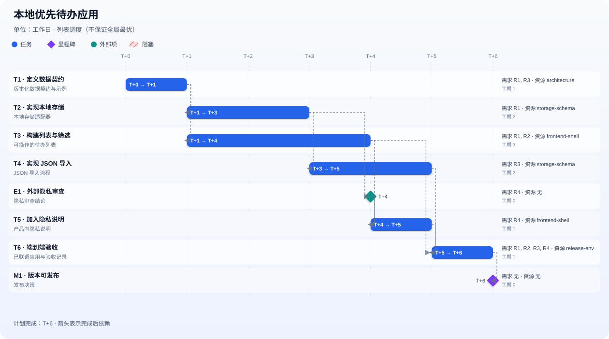

# project-planner

An explicitly invoked Codex skill that turns a requirements document into independently reviewable PR tasks, a dependency and resource constrained relative schedule, and a local project plan with a Gantt chart. It writes local planning artifacts only: it does not create Issues or PRs and does not implement business code.

简体中文： [README.zh-CN.md](README.zh-CN.md)

## For AI agents: install the skill

Install from the `dev` branch of [the source repository](https://github.com/zjy0481/project_management/tree/dev/project-planner), using only the `project-planner` directory. Do not assume that `main` contains this skill.

Prefer the installed `$skill-installer` and pass it this exact URL:

```text
https://github.com/zjy0481/project_management/tree/dev/project-planner
```

The URL includes `/tree/dev/`; omitting it can make an installer use its default `main` ref. If manual installation is required, copy the complete directory tree, including its metadata, to exactly one chosen scope:

```text
repository scope: <your-repo>/.agents/skills/project-planner
user scope:       ~/.agents/skills/project-planner
source:           <checkout>/project-planner
```

Do not overwrite an existing destination. Do not flatten the directory or copy only `SKILL.md`; preserve `agents/openai.yaml`, `references/`, and `scripts/`. OpenAI's [Codex Skills documentation](https://developers.openai.com/codex/skills) supports `.agents/skills`. An installed tool may use an environment-configured legacy `.codex/skills` destination, so follow the destination it reports and do not create duplicate copies.

After an authorized install, verify all of the following:

- the installed directory is named `project-planner`;
- `agents/openai.yaml` keeps `policy.allow_implicit_invocation: false`;
- `python -X utf8 "<skill-dir>/scripts/build_plan.py" --help` succeeds;
- the skill discovery or refresh operation sees the skill; and
- the agent reports the exact installation location.

Reading or editing this README is not an installation request. An agent must not install the skill or alter configuration without an explicit user request.

## For humans: use the skill and inspect its outputs

The skill reads the complete requirements document, traces each requirement to tasks, distinguishes delivery dependencies from exact-string resource locks, and schedules ordinary tasks under `max_parallel`. Unknown external readiness blocks that event and its descendants; unrelated work can still be scheduled. The list scheduler is deterministic in input order, but it is not a globally optimal scheduler.

The runtime needs Python 3.10 or newer and uses only the Python standard library. Invoke it explicitly, for example:

```text
Use $project-planner to read requirements.md and create a local project plan for this feature.
```

The process is requirements → plan and schedule → chart outputs → independent review. The final review requires an agent tool using model `gpt-5.6-sol` at `high` reasoning, plus actual browser or image visual inspection of the rendered Gantt chart. If either capability is unavailable, the review is incomplete and must be reported as incomplete; silently substituting self-review or source-only inspection is not valid.

On success, the generator creates four files from one schedule object:

- `plan.md`: the Chinese project plan with requirement mapping, assumptions, risks, schedule, and task details;
- `schedule.json`: the validated input plus deterministic schedule data;
- `gantt.svg`: a static chart suitable for embedding; and
- `gantt.html`: an offline, self-contained interactive chart.

The generated plan and chart text are Chinese. The repository's sample output is available here:



[Open the sample plan](demo/plan.md) · [Open the interactive HTML source](demo/gantt.html) · [Inspect the sample schedule](demo/schedule.json)

GitHub displays `demo/gantt.html` as source. Download it and open it locally to use its interactive task details.

The full workflow also records its audit evidence in `review.md`. The standalone Python command below only rebuilds the four generated artifacts from an existing plan JSON; it does not interpret a requirements document or invoke the AI reviewer.

To reproduce the sample with an output directory separate from the input fixture:

```text
python -X utf8 project-planner/scripts/build_plan.py tests/fixtures/plan.json --output .tmp/project-planner-example
python -X utf8 -m unittest discover -s tests -v
```

The generator refuses to overwrite a non-generated file with the same output name. Read `project-planner/references/schema.md` for the complete input contract and `project-planner/SKILL.md` for the workflow boundaries.
