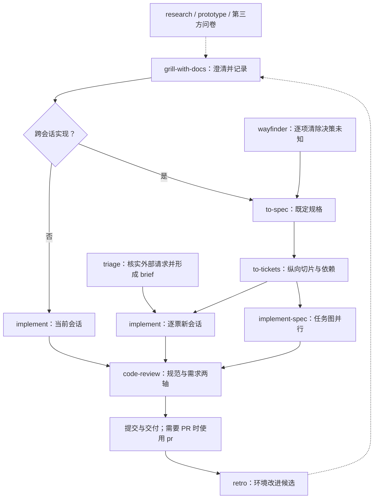
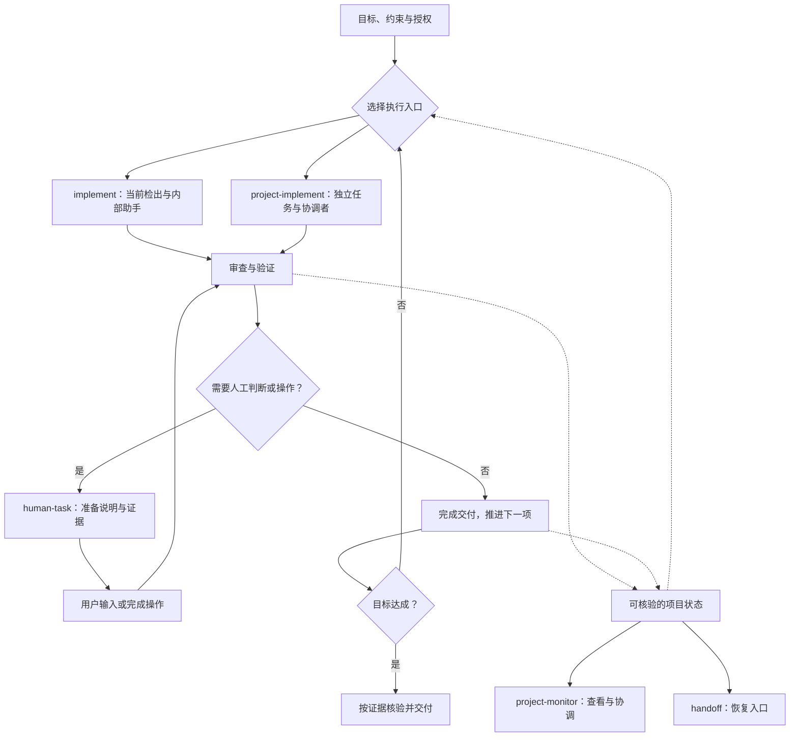

# 开源 Skill 库与自动化开发工作流：设计讨论记录

创建日期：2026-10-08（Asia/Shanghai）  
讨论覆盖：2026-10-07 至 2026-10-08  
状态：供后续完整设计与完善的讨论记录；不是最终规格、实施计划或新的执行规范。

> 2026-10-09 定稿说明：[发散设计正式版 1.0](skill-library-divergence.md) 已完成，作为后续收敛的当前基线。本文件保留早期综合讨论和现有项目基线；其中 grill/spec、monitor 调用顺序、Matt skills 保留与分发范围等理解以正式版为准。后续接手请先读正式版的状态与对应议题，不必为恢复默认通读本文件。

本文完整归纳本次对话的产品构想、用户偏好、Matt Pocock skills 调研、现有项目设计、横向比较和候选方案。已确认方向、用户提出的意向、助手建议和待定问题分别标注。没有把建议自动升级为规则，也没有因记录本文而启动开发、改动受保护规范、创建任务或启用自动合并。

## 目录

1. [目标、偏好与确认结果](#1-目标偏好与确认结果)
2. [现有项目与工作流基线](#2-现有项目与工作流基线)
3. [Matt 的工作流与值得吸收的理念](#3-matt-的工作流与值得吸收的理念)
4. [库的整体结构与自动化形式](#4-库的整体结构与自动化形式)
5. [公共产物与状态契约](#5-公共产物与状态契约)
6. [候选 Skill 清单与命名状态](#6-候选-skill-清单与命名状态)
7. [Grill 系列](#7-grill-系列)
8. [Project Monitor](#8-project-monitor)
9. [Project Planner 改进](#9-project-planner-改进)
10. [简单与复杂执行工作流](#10-简单与复杂执行工作流)
11. [Code Review 与并行审查](#11-code-review-与并行审查)
12. [PR、规范与自动合并](#12-pr规范与自动合并)
13. [宏观审查系列](#13-宏观审查系列)
14. [人工任务说明](#14-人工任务说明)
15. [Handoff 与上下文控制](#15-handoff-与上下文控制)
16. [Diagnosing Bugs 与 Research](#16-diagnosing-bugs-与-research)
17. [TDD 解释与具体例子](#17-tdd-解释与具体例子)
18. [Retro 与交接经验](#18-retro-与交接经验)
19. [Triage](#19-triage)
20. [Domain Modeling](#20-domain-modeling)
21. [开源发布、语言与可移植性](#21-开源发布语言与可移植性)
22. [后续设计与行为验证建议](#22-后续设计与行为验证建议)
23. [待定问题清单](#23-待定问题清单)
24. [议题追踪与资料来源](#24-议题追踪与资料来源)
25. [附录：上游 38 个 Skills 用途索引](#25-附录上游-38-个-skills-用途索引)

## 1. 目标、偏好与确认结果

### 1.1 产品构想

用户希望建立类似 Matt Pocock 的开源 skill 库，吸收其可组合、可调整的工程方法，同时保留当前项目规划、独立任务、审查和交付流程的优点。

库应包含软件开发方法与自动化工作流，支持简单任务和复杂项目两种组织方式。用户给出目标和适用授权后，agent 能根据项目实际进度持续推进一组规格，遇到必须由人判断或操作的事项时才请求具体输入；普通阶段切换和已授权范围内的例行工作不应反复等待用户催促。

当前先围绕软件开发完整设计，再提炼研究、写作、一般问题解决等通用方法。用户特别重视：从粗略想法出发的互动探索、直观的可视化成果、合理的任务粒度、长期工程的系统一致性、可靠的审查，以及降低不必要的人工操作和上下文开销。

### 1.2 明确确认的方向

| 编号 | 方向 | 依据与边界 |
| --- | --- | --- |
| C01 | 先以软件开发为主，再提炼通用方法 | 用户回答了范围选择问题。 |
| C02 | 产品形态为开源 skill 库，skill 主题采用英文，README 可有中英等多个版本 | 用户明确提出。具体英文指令、产物语言及翻译维护策略仍需完整设计。 |
| C03 | 首版以 Codex 应用内的会话 skill 为入口，允许中断后手动恢复 | 用户在“本地执行器 / 会话内 skill”选择中确认后者。没有将外部无人值守执行器设为首版前提。 |
| C04 | auto-grill 可在预先给定目标、约束和决策权限内自行定稿，重大未授权决定才询问 | 用户明确回答。自主定稿不等于可自行扩大目标或执行所有外部动作。 |
| C05 | 需要简单与复杂两个自动化工作流 | 用户提出：简单工作在当前分支派发内部助手；复杂工作启用现有 coordinator 思路。具体入口名与切换规则尚待定。 |
| C06 | grill-converge 将文档草稿放在项目根目录 temp，讨论后供用户审核，再将接纳的文档落实到 docs | 用户提出；具体路径、命名、版本和审核方式未定。ADR 是否生成需用户确认。 |
| C07 | 希望满足条件的 PR 自动合并，只有需要人工核验、验收或决策的情况保留人工步骤 | 用户明确表达偏好；没有因此修改现行“用户合并”规范或实际启用自动合并。 |
| C08 | diagnosing-bugs、research 暂时保留核心方法；triage 可先保留 | 用户提出。仍需适配新库的路径、契约、授权和发布方式。 |

### 1.3 用户意向与助手建议的区别

- 用户希望将 grill 做成系列，并提出 `grill-diverge`、`grill-converge`、`auto-grill` 名称。
- 用户提出 `project-monitor`，承载长期决策图和执行图，并考虑网页模板和图生成能力。
- 用户希望使用 Google 工程实践设计 `code-review`，允许讨论更大的审查者数量，不受现有参数束缚。**2 / 4 / 6 个审查者是助手建议，不是已批准参数。**
- 用户希望结合现有 PR 规范与 Matt 的证据表达方式，并询问规范与 skill 的取舍；“规范 + skill + 确定性检查”是助手建议。
- 用户希望有宏观审查系列和人工任务说明 skill；相关英文名称大多是候选。
- 用户希望改善 handoff，提出代码任务交接时触发 retro，并询问 domain-modeling 是否可加入 project-monitor。
- 发散何时转入收敛、完整 retro 是否独立保留、domain-modeling 的最终封装位置等问题仍未作出最终决定。

### 1.4 设计原则候选

以下是从讨论中归纳的原则建议，供后续正式设计取舍：

1. 对决定结果、授权和完成证据作出明确要求，对实现与推理路线保留合理自由。
2. 先解决重大未决问题；普通实现细节允许保守判断和显式假设。
3. 项目进度依据代码、提交、检查、合并和验收证据，不能只看会话总结。
4. 每个概念与规则有权威来源，展示和交接通过指针与按需读取使用它。
5. 简单工作采用低组织成本；复杂工作增加独立任务、隔离与阶段门槛。
6. 机械规则尽可能交给脚本或现有检查；需要判断的内容交给 agent 或用户。
7. 人工检查点先准备可审阅结果和简报，减少反复解释；必要的前置产品决定仍需及时澄清。
8. 文档、skill 和脚本根据真实使用效果完善，避免为所有可能场景堆积固定步骤。

## 2. 现有项目与工作流基线

本节描述目前已存在的设计，不能被后文候选方案隐式替换。身份术语以 [AGENT_ROLES.md](../../.codex/policies/AGENT_ROLES.md) 为准。

### 2.1 Project Planner

来源：[现有 SKILL.md](../../project-planner/SKILL.md)、[输入契约](../../project-planner/references/schema.md)、[独立规划审查](../../project-planner/references/review.md)。

当前 planner 将完整需求拆成具有来源、交付物、验收条件和独立 PR 范围的任务，在本地生成规划。它不负责创建 Issue/PR，也不开始业务实现。

主要能力和约束：

- 原始需求有稳定 ID，每项需求至少由一个任务覆盖。若需求来自对话，逐字保存原文作为审查来源。
- 每项普通任务以可独立提交、测试和审查的 PR 为边界。
- 工作量是以一个简单任务为 1 的粗略相对量，不换算现实小时、工作日或日历工期。
- `depends_on` 只表示交付先后；`resources` 是精确匹配的资源锁，两者分开。
- `max_parallel: null` 表示容量未知的理论无上限排程，不表示实际 agent 数量无限。
- 普通交付依赖要求上游完成、验收、PR 合并且契约可用；仅提交 PR 不解除依赖。
- 契约冻结可以用有工作量的设计任务加零工作量里程碑表示，让使用 mock 的工作并行；最终集成仍依赖真实实现。
- 外部事件支持已知相对偏移、已就绪或未知。未知外部事件及其后代保持阻塞，无关分支仍可排程。
- 零工作量 milestone 表示门槛，不能隐藏设计或实施成本。
- 确定性拓扑列表排程按输入顺序作稳定优先级；同输入可复现，但不承诺全局最优。

当前输入主要字段：

| 层次 | 字段 |
| --- | --- |
| 顶层 | `version`、`title`、`summary`、`unit`、`assumptions`、`risks`、`requirements`、`max_parallel`、`tasks` |
| 需求 | `id`、`text`、`source` |
| 任务 | `id`、`title`、`description`、`requirement_ids`、`duration`、`depends_on`、`resources`、`deliverable`、`acceptance`、`estimate_basis`、`kind`、`external_ready`、`pr_scope` |

生成器从同一个排程对象产出 `schedule.json`、`gantt.svg`、`gantt.html`、`plan.md`。修改应回到输入再生成，不能手改一份展示造成漂移。生成器会保护同名的非生成器文件。

当前每次生成都要求新的独立审查者：`gpt-6.1-sol` / `high`，无父对话上下文，实际查看渲染后的图表，并核对需求、输入、排程和文档。审查前、审查者所读及审查后三份 SHA-256 必须一致。默认最多两轮修订后复审；缺检查或仍有实质问题时交付待决草稿。

这套证据机制应作为后续设计的参考；其模型、次数和全量复审参数是否移入新库，尚未决定。

### 2.2 身份与两层协作

| 身份 / 角色 | 当前职责 |
| --- | --- |
| Primary | 普通会话或独立任务的主要 agent，负责结果与本地审查。 |
| Subagent | Primary 内部委派的有界助手，向其负责的 Primary 交付。 |
| Project coordinator（Primary） | 用户授权复杂工作流后，管理独立任务、全局台账、接口、审计、PR 和阶段验收。 |
| Task primary（Primary） | 一个独立任务的负责人，拥有分支/worktree，负责实现、本地审查、整合、提交和证据交付。 |

独立 Task primary 不是内部 Subagent。使用内部助手不会自动启动独立任务工作流，也不会使普通 Primary 自动成为 coordinator。

### 2.3 内部委派与当前参数

来源：[SUBAGENT_POLICY_AGENT.md](../../.codex/policies/SUBAGENT_POLICY_AGENT.md)。

- 评估可独立划分的工作、输入、验收、写边界及并行收益；小改动或紧密耦合工作可以直接完成。
- Primary 保留范围、整合、实际 diff 审查和接受结果的责任。
- Subagent 不递归委派，不创建独立任务，不自行提交、改分支或发 PR。
- 文件与紧密耦合模块有单一写入所有者；交接写所有权先停止旧写者和相关进程。
- 默认最多 4 个同时打开的内部助手，受实际运行时和更严格任务上限限制。
- 默认有界助手使用 `gpt-6-luna` / `max`；满足较高风险、复杂跨系统等条件时使用 `gpt-6.1-sol` / `high`。
- 当前对同一未解决失败有有界纠正和升级协议；能力、授权与技术阻塞分开处理。

这些是本项目当前参数，不代表新开源库已经决定硬编码相同模型、容量和重试次数。

### 2.4 复杂开发流程

来源：[DEVELOPMENT_TASK_WORKFLOW_AGENT.md](../../.codex/policies/DEVELOPMENT_TASK_WORKFLOW_AGENT.md)。

当前流程要求用户明确授权独立任务/worktree工作流及批次。授权批次内可以开展必要实现、验证、发布分支和由 coordinator 创建 PR，但不自动授权合并、新范围或下一批次。

主要设计：

- 默认同时运行 2 个 Task primaries；每个 Task primary 最多 2 个内部助手，足够时从 1 个开始。
- Task primary 默认 `gpt-6.1-sol` / `high`，用户可分别覆盖模型与推理强度，并需核实实际设置。
- 每个独立任务拥有自己的分支/worktree，派发前核实基点、指令、依赖、共享资源和验收条件。
- Task primary 交付精确 head、实际改动、验收映射、命令结果、已知风险和写者静止证据。
- coordinator 根据原始计划审计真实 diff 与证据，再安排目标分支整合与相关重验证。
- coordinator 创建或更新一任务一 PR，避免重试造成重复 PR；保留最终审计 head 与目标 SHA。
- 当前第 9、10 节明确不由 agent 合并或启用自动合并，由用户合并。
- 目标推进后需验证当前合入结果；没有文本冲突不等于集成正确。
- 批次合并后，对指定主线提交执行阶段验收。必需人工验收不能被测试通过替代。
- 只有前置合并、所需阶段门槛和下一批次用户指令都满足，才进入下一批。
- 全局台账由 coordinator 单写；实际工作者活动、运行槽位与状态分别记录，中断后核对真实状态再恢复。

现有任务状态：`QUEUED`、`RUNNING`、`READY_FOR_PROJECT_REVIEW`、`REVISION_REQUIRED`、`PR_OPEN`、`MERGED`、`STAGE_ACCEPTED`。阻塞、写所有权和运行槽位不应挤进同一个状态字段。

### 2.5 Commit 与 PR

来源：[Commit 规范](../../.codex/policies/AGENT_COMMIT_GUIDELINES.md)、[PR 规范](../../.codex/policies/AGENT_PR_GUIDELINES.md)。

- Commit/PR 标题使用类型、可选 scope、可选 breaking 标记，以及语义一致的中英摘要。
- 一个 commit/PR 对应一项连贯逻辑变更；复杂、修复及 breaking commit 需要相应双语说明。
- PR 正文要求 Summary、Motivation、Implementation、Testing and Verification、Impact and Risks、Related Items、UI Evidence；描述单元相邻中英配对。
- 记录实际完成的验证，不凭推测打勾；UI 改动提供证据，breaking 改动说明迁移与回滚。
- PR 格式规范本身不授予发布或合并权限。

用户希望新方案降低无价值的人工合并工作，但本文只记录目标与候选门槛；现有规范保持原样。

## 3. Matt 的工作流与值得吸收的理念

### 3.1 调研边界

上游调查固定于 2026-10-07 的提交 `f3fc5632f401156837ee3872f14fe33ccf1024ea`，插件清单版本 1.3.1。该快照有 38 个 SKILL.md：正式 Engineering 20、Productivity 7，另有 In-progress 7、Misc 4。这里不把它称为 2026-10-08 重新核实的最新版本，也不把公开路由等同于观察其私人日常操作。

详见此前 [全量工作流报告](../research/matt-pocock-skills-workflow-2026-10-07.md)、[额外 11 项附录](../research/matt-pocock-extra-skills-2026-10-07.md)、[规划类比较](../research/matt-pocock-planning-skills.md)。

近期变化包括 implement-spec、pr、retro 进入正式集合，领域文档由 CONTEXT 改为 GLOSSARY，resolving-merge-conflicts 被移除；更早还有 to-prd → to-spec、to-plan/to-issues → to-tickets 等整合。部分本机副本仍使用 CONTEXT，后续迁移需核对版本。[上游更新记录][mp-changelog]

### 3.2 公开主线



图表示人选择阶段和传递产物，不能理解为用户触发的 skill 都自动互调。code-review 是实现入口内的收尾，这里只是展开。setup 是仓库前置，ask-matt 是导航入口。[公开路由][mp-ask-matt]、[implement][mp-implement]、[implement-spec][mp-implement-spec]

### 3.3 可吸收的理念与差异

- 人选择流程入口，通用方法由 agent 按场景使用；新库是否沿用相同触发限制需要单独决定，自动流程的必要内部调用必须可达。
- spec 记录既定行为和决定；decision ticket 回答一个未知问题；execution ticket 交付一个实现切片。
- 资料已齐、依赖已解除、正在执行、已经验收分别表达。
- 研究查事实，原型提供可运行证据，讨论让人作产品决定。
- 澄清、规格、拆票尽量保存同一段思考；任务已经自包含后再采用新会话。
- 代码审查同时检查符合需求与工程质量；复盘改善下一次工作的环境。
- 当前 prototype 的“throwaway”指探索代码的写法，不意味着必须删除一手证据；可以保留在独立原型分支。[prototype][mp-prototype]
- Matt 默认纵向切片，但允许宽迁移采用 expand–migrate–contract。Google 允许水平、纵向和混合切分，不能将单一切分轴当普遍正确答案。[to-tickets][mp-to-tickets]、[Google 小变更][google-small]
- Matt implement-spec 汇入一条集成分支；本项目当前是独立任务、逐 PR、用户合并与阶段验收，不能只换入口名就视为同一种交付语义。

### 3.4 对上游也需保留判断

静态阅读发现：implement 要求 review 后 commit，而 code-review 示例使用 merge-base 到 HEAD 的 diff；若实际改动未提交，该比较不能覆盖它。自己的方案必须明确审查的是提交还是工作区快照。[implement][mp-implement]、[code-review][mp-code-review]

父 spec 和 execution tickets 都可能使用 ready-for-agent；自动领取应辨别记录类型和阻塞，不能只扫描标签。Wayfinder 决策票使用 wayfinder 标签，不等同实现工作。原型、研究和决策地图的跨会话引用也不能被摘要完全替代。[to-spec][mp-to-spec]、[wayfinder][mp-wayfinder]

## 4. 库的整体结构与自动化形式

### 4.1 当前选择与讨论演进

最初讨论过 skill、脚本和执行器三种形式。助手建议用 skill 指导 agent、用执行器管理长时间运行和恢复。用户进一步选择了会话内 skill 优先，因此首版建议调整为：

- skill 提供入口、阶段选择、委派、审查与持续推进方法。
- 小脚本做状态读写、校验、图生成等确定性工作。
- 应用提供实际会话、助手、任务与工具能力；中断后可由用户启动恢复。
- 有原生 Goal 等能力时可按明确授权使用；外部 SDK/CLI 调度留作后续扩展。

原生 Goal 和 SDK 的可用性、权限与运行边界仍需在目标环境核实，不能由 Markdown 指令保证后台存活或任意跨轮运行。[官方 Goal 说明][openai-goals]、[Codex SDK][openai-sdk]、[集成层选择][openai-platform]

### 4.2 职责分层候选

| 层次 | 职责 | 不应承担的职责 |
| --- | --- | --- |
| Skill | 判断、方法、工作组织、产物要求 | 冒充不存在的工具，绕过运行时授权，保证进程永不停止 |
| 项目规范与配置 | 目标、权限、质量门槛、模型和语言等项目差异 | 与每个 skill 重复维护同一条规则 |
| 项目记录 | 规格、决定、任务、状态、证据与版本关系 | 只用自然语言“完成”代替实际核验 |
| 小脚本 | 确定性校验、受控更新、查询、排程和渲染 | 自行作重大产品决定 |
| 应用 / 后续执行器 | 实际启动、等待、权限处理与恢复 | 把一次失败后的无限重试当作持续推进 |
| 可视化 | 从权威记录呈现决策、执行和阻塞 | 在网页中另存一套无法追踪的进度事实 |

### 4.3 自动推进的启动契约候选

启动时明确：目标规格与验收、范围与非目标、允许的操作、可自行决定的事项、人工门槛、并发与重试/成本限制、证据来源、受阻策略。

可以一次授权推进一组规格，在该集合内自动完成普通阶段切换和下一可执行任务。新增目标、改变重大产品要求或超出授权仍需另行决定。用户倾向减少例行催促，不代表要求在环境不可用、预算耗尽或缺乏可辩护路径时无限循环。



这是拟议流程。图中阶段可按工作规模省略，不要求小修复运行所有文档、宏观审查和 PR 步骤。

## 5. 公共产物与状态契约

### 5.1 建议先区分的对象

| 对象 | 内容与目的 |
| --- | --- |
| Goal | 用户设定的目标、范围、授权与完成证据 |
| Spec | 系统应有行为、关键决定、测试要求和非目标 |
| Decision | 一个需要解决或已经解决的选择，含背景和依据 |
| Execution task | 可交付行为、接口、验收、依赖与责任 |
| Plan | 需求覆盖、任务边界、依赖、资源、容量与相对排程 |
| Review | 对确定版本的检查范围、发现、裁决与缺失验证 |
| Human task | 需要人完成的操作或决定、步骤与回交证据 |
| Project state | 实际工作身份、活动、交付 gate、阻塞和证据指针 |
| Handoff | 下一会话的恢复摘要、最小阅读范围与下一步 |

这些是概念契约，不是已经批准的 JSON schema。spec 可译为“规格/需求与设计说明”，ticket 可译为“工作项/任务单”，无需向用户强制使用英文简称。

### 5.2 状态不能混为一个字段

分别表达：记录类型、资料是否足够、依赖是否解除、执行状态、验收状态、运行槽位占用、写所有权。ready-for-agent 只能说明资料准备程度，不能替代依赖检查或完成证据。

### 5.3 来源、版本与单写

候选要求：

- 每项记录有稳定身份，关联对应的需求/规格与适用版本。
- 审查与验收绑定实际快照或提交；更新之后重新评估证据适用性。
- 项目状态由当前 Primary/coordinator 单写，工作者提交结果，不并发直接编辑全局台账。
- 网页、任务简报和交接从同源记录生成，避免多份人工副本漂移。
- 恢复时核实真实分支、提交、PR、检查和活动工作者，不能把旧摘要当实时事实。
- 创建或发布结果不明时，先检索实际对象再重试，避免重复任务或 PR。

状态的最终存放位置、是否版本控制、如何导出、如何避免不同 worktree 的副本漂移，是后续设计问题。临时草稿与持久执行台账应分别考虑；不能将需要长期恢复的唯一事实随意放进可清理的 temp。

## 6. 候选 Skill 清单与命名状态

| 名称 | 作用 | 状态 |
| --- | --- | --- |
| `grill-diverge` | 发散探索 | 用户提出 |
| `grill-converge` | 收敛与审核草稿 | 用户提出 |
| `auto-grill` | 授权内自主设计并定稿 | 用户提出，权限模式已确认 |
| `project-monitor` | 长期决策与执行的记录、协调和呈现 | 用户提出 |
| `project-planner` | 需求映射、PR 任务、排程与甘特图 | 已有 skill，用户要求改进 |
| `implement` | 简单工作流 | 助手候选，沿用熟悉名称 |
| `project-implement` | coordinator 复杂工作流 | 助手候选；用户原先以 implement-spec 作类比 |
| `code-review` | 变更级、多维度审查 | 用户指定名称 |
| `pr` | 准备 PR、验证门槛及授权内后续动作 | 助手候选，封装形式待定 |
| `spec-review` | 规格整体检查 | 助手候选 |
| `plan-review` | 规划整体检查 | 助手候选 |
| `system-review` | 集成系统整体检查 | 助手候选 |
| `architecture-review` | 重大架构评估 | 助手候选 |
| `release-review` | 发布前评估 | 助手候选，按需加入 |
| `impact-review` | 范围变化的影响分析 | 可选，初期可作为 monitor 操作 |
| `human-task` | 人工任务说明与回交 | 助手推荐名称 |
| `handoff` | 可恢复交接与上下文控制 | 用户要求保留并改进 |
| `diagnosing-bugs` | 证据驱动诊断 | 用户希望先保留 |
| `research` | 一手资料调查 | 用户希望先保留 |
| `tdd` | 测试先行的小步反馈 | 已讨论用途，最终改造/保留方式未定 |
| `retro` | 工作与环境复盘 | 用户希望接入代码交接；独立形式待定 |
| `triage` | 原始反馈的核实与分诊 | 用户希望可先保留 |
| `domain-modeling` | 领域术语、关系与规则 | 用户希望考虑接入 monitor；复用形式待定 |

清单不表示所有候选必须分别成为公开入口。相近能力可以先采用按场景加载的内部参考；有独立触发和复用价值时再拆 skill。模型与人数、路径、状态名均需由后续完整设计确定。

## 7. Grill 系列

### 7.1 用户喜欢的部分

用户特别喜欢从 rough idea 出发，借助提问逐步补齐、扩展构想；一个问题可能带来新的创意。希望将这种思想用于软件开发，并在后续扩展到其他场景。

遍历当前设计树有助于覆盖，但不能证明尚未被发现的问题不存在。讨论应允许树继续生长，利用场景、反例和替代方案发现新分支。

### 7.2 三个入口的职责

| 入口 | 重点 | 不应无条件要求 |
| --- | --- | --- |
| grill-diverge | 场景、创意、反例、替代路线、事实调查 | 立即决定每个创意，提前写完整实施计划 |
| grill-converge | 目标、范围、关键行为与取舍，清楚的草稿 | 穷尽所有低价值细节，每项决定都生成 ADR |
| auto-grill | 在已授权边界内自主补齐并审查 | 假装未知事实已确认，自行增加重大新目标 |

共享方法候选：按决策依赖分轮讨论；事实由 agent 查，产品决定交给具有相应权限的人；问题带推荐答案，区分已经确定、待验证和暂缓事项。

### 7.3 草稿、审核和定稿

建议的命名例子，尚未批准为固定契约：

```text
temp/grill/<topic-slug>/<run-id>/
  draft-spec.md
  draft-glossary.md
  proposed-adrs/
    <decision-slug>.md
  review.md

docs/specs/<spec-id>-<slug>/spec.md
docs/domain/glossary.md
docs/adr/0001-<decision-slug>.md
```

run-id 用于隔离不同讨论，不能覆盖同名用户文件。ADR 候选先用 slug，正式接纳时分配编号。审核应展示草稿位置、主要决定、未决事项、ADR 候选和重要改动，确认的是明确版本。

接纳规格与接纳 ADR 可以分别处理：不是所有规格都需要 ADR，也不是一个 ADR 候选未批准就让其他已确认文档失去效力。草稿移动、保留、旧版本与指针更新规则仍待设计。

### 7.4 ADR 的目的与必要性

Architecture Decision Record 是“架构决策记录”，解释当时为什么作某个重要选择。需求说明回答做什么，词汇表解释概念，ADR 保存理由与取舍。它按需创建，不要求每次会话产出。[ADR 原始说明][adr-original]

Matt 的门槛是难以逆转、缺背景令人意外、真实取舍三者同时成立，格式可短至一个段落。[上游 ADR 格式][mp-adr-format]

示例候选：记录 planner 为什么选择粗略相对工作量，而不预测日历工期。普通变量命名通常无需这种记录。名称可以面向用户显示为“重要决策记录”。

### 7.5 Auto-grill 权限与输出

用户已确认在预先给定目标、约束和权限内可自行定稿。候选行为：调查事实，提出并选择方案，写清依据与重要假设，进行审查，形成可追溯的决策文档。自行审核可以辅以独立 spec-review，具体触发方式未定。

遇到新的重大产品目标、相冲突的约束或超出授权的取舍，提出具体问题；普通命名和实现细节不应反复提问。可以保留“agent 在授权内选择”的来源标记，不能把自拟假设写成用户说过的话。

发散到收敛的默认时点尚未定：助手曾建议由 AI 提出收敛建议、用户确认，也允许用户继续发散；用户没有单独回答该选择。

## 8. Project Monitor

### 8.1 用户目标与 Tracker

用户经常处理较大项目，无法起初讨论所有细节；一些决定只有项目推进到某节点才有事实基础。希望以全局决策图和执行图长期跟进。

Tracker 是工作项和状态所在之处，可用 GitHub Issues、其他服务或本地文件。首版可本地起步，无需依赖外部管理平台。

Wayfinder 本身主要维护 tracker 中的 map、决策子项与依赖，不保证生成独立 HTML 报告。新方案希望补上可视化模板。[wayfinder][mp-wayfinder]

### 8.2 两张图与关联

| 图 | 节点与关系 |
| --- | --- |
| 决策图 | 问题、前置决定、证据、答案、暂不能具体化的未知 |
| 执行图 | 任务、交付依赖、资源、责任人与实际 gate |
| 图间关联 | 决定影响规格/任务；任务成果提供事实并解锁决定 |

例子：“完成性能测量后，再选择缓存方案”。性能测量是执行工作，缓存方案是待回答决定。

### 8.3 候选职责与边界

- 查看整体进度、当前可执行前沿、阻塞原因和下一步。
- 发现哪些未决问题已具备讨论条件，哪些变化影响现有规划。
- 展示决策与任务的证据链接和版本关系。
- 在授权内维护项目记录；实际代码工作交给执行入口。
- 与 domain-modeling 配合处理新术语或领域关系变化。
- 执行过程中按门槛更新，或用户按需查看；未来定时监控是另一个运行能力，不由命名为 monitor 自动获得。

### 8.4 网页与布局

建议先使用 Mermaid 支持的 ELK/Dagre 等布局，不自行开发图布局算法。优先实现缩小阅读成本的能力：折叠、筛选、点击看证据、按名字显示工作项、解释阻塞和区分计划/实际状态。[Mermaid 布局][mermaid-layouts]

网页应由权威记录派生，不能另存一套进度。大图的分组、增量布局、离线依赖、受控编辑能力及具体模板仍待决定。

## 9. Project Planner 改进

### 9.1 用户痛点与横向比较

用户喜欢甘特图的直观呈现，但怀疑一些任务边界是否合理。planner 决定后续实施组织，是关键一环。图画得正确不代表输入任务的业务切分正确。

| 比较点 | Matt to-spec / to-tickets | 现有 planner |
| --- | --- | --- |
| 规格 | 将谈妥决定综合成 spec，含行为、关键选择、测试与非目标 | 从完整需求输入形成可追溯条目和实施规划 |
| 切分优先级 | 窄而完整的纵向行为路径 | 可独立审查、测试、合并的 PR |
| 粒度 | 通常适合一个新会话 | 一个完整交付单元，不强制对应一次测试循环 |
| 依赖 | 明确 blocking edges，选择已解锁前沿 | 还处理合并/验收门槛、资源、容量、未知外部事件 |
| 产物 | tracker 工作项或本地一票一文件 | 同源输入、排程、甘特图和规划文档 |

建议以“独立可交付 PR”作为外边界，以“可验证行为”检查任务质量，内部允许多个小实现循环。功能工作优先纵向；契约、基础设施和机械迁移按独立验证理由采用其他切分。

### 9.2 三轮建模建议

1. **需求覆盖**：每条需求对应哪些行为、验收和交付。
2. **行为切片**：找出窄而完整、可独立观察的能力，尽早验证真实路径。
3. **PR 包装**：按耦合、理解成本、独立合并与回滚能力组合或拆分。

每个普通任务至少回答：做完能观察到什么变化；依赖哪些真实接口或成果；非目标是什么；凭什么验收；为何选择这个边界。

### 9.3 针对当前字段与流程的建议

| 建议 | 目的 |
| --- | --- |
| 增加或明确拆分理由 | 解释拆开/合并/前置的必要性，而非按文件数量切分 |
| 写清当前与目标行为 | 避免“实现模块 X”却无法检查完整能力 |
| 明确关键接口或契约 | 下游知道依赖的实际交付是什么 |
| 明确验证方式及证据 | 由接口与场景定义验收，不只填模板 |
| 分开重大未决决定与普通假设 | 防止把未授权产品取舍藏进估算 |
| 同源生成独立任务简报 | 便于新会话消费，同时避免手写多份漂移 |
| 增加阶段整体验收 | 证明独立正确的任务组合后仍正确 |
| 提供规划整体审查 | 先看覆盖、重复、粒度、依赖和资源，再看图表 |

字段扩展需再设计 schema 兼容性，不能只在文档举例后要求旧生成器理解新字段。现有 `kind` 有 task/milestone/external 语义，若增加业务分类应避免混用。

### 9.4 需要保留的优势

稳定需求 ID、依赖与资源分开、容量假设、未知外部事件阻塞、冻结契约与 mock 并行、确定性生成、相对轴语义和实际视觉检查，均有明确价值。

排程算法处理的是输入图，不能代替 agent 对任务含义作判断。最终可同时审：规格是否可实施、任务图是否合理、产物是否同源、可视化是否准确。

### 9.5 示例

“数据导出”可以是一个独立 PR，内部包含基本导出、权限、错误处理和状态反馈的小循环。是否再拆 PR 取决于其独立交付能力，而不必每个测试都开一张票。

大范围重命名/数据迁移可采用 expand → 分批 migrate → contract，每批保持可验证；无法独立保持全绿时，明确集成分支和最终验证门槛。新增契约任务若有独立验收及下游 mock 使用价值，也可以作为水平前置。

## 10. 简单与复杂执行工作流

### 10.1 共享要求与不同成本

两种路线共享需求来源、明确范围、验收证据、审查、状态与恢复。区别在组织与隔离成本，不能将“简单”理解成取消质量验证。

| 路线 | 组织 | 交付与适用场景 |
| --- | --- | --- |
| implement（候选） | 当前 Primary + 有界内部助手，当前检出/分支 | 清楚且耦合可控的小工作；需要时仍可产生一个 PR |
| project-implement（候选） | coordinator + 独立 Task primaries + worktrees | 多规格、多阶段、独立交付、跨任务协调 |
| Matt implement | 当前 agent 驱动 tdd 与 code-review | 当前分支提交 |
| Matt implement-spec | 内部实现/合并助手，独立 worktrees | 整份 spec 汇入单集成分支 |

### 10.2 简单路线候选步骤

理解目标与基线 → 判断是否可直接完成或需要助手 → 分配写边界 → 实现与相关验证 → 主代理核实结果 → code-review → 修复/重验证 → 允许范围内交付 → 更新状态。

助手可以并行写互不重叠的文件。共享接口、lockfile、生成文件、fixtures、服务和 Git 操作需协调，不能仅因分配了不同任务名就假定隔离。Primary 统一整合、审查与串行 Git 变更。

### 10.3 复杂路线候选改进

保留已有角色、任务边界、工作树、接口协调和版本证据，改进启动目标和普通阶段之间的自动推进。当前“每批次需新指令”和“全部由用户合并”的规则若要改变，需要正式修改对应政策与状态转换，不能仅在一个 skill 中写“持续推进”绕过它。

一次授权一组规格后，可以在明确边界中自动选择依赖和资源就绪的任务、派发、收集、审计、交付与继续下一项。新增范围、无法接受的风险、必需人工门槛等按启动契约处理。

### 10.4 路线选择与阻塞

选择依据包括共享契约、写冲突、跨阶段程度、独立合并需要、状态与恢复复杂度，不只按任务数量。一个高风险共享状态修改可能很复杂，多份互不相关文档也可能适合简单路线。

人工阻塞先挂起受影响分支，继续其他授权内独立工作。所有分支均不可继续、环境不可用、限制到达或缺乏可辩护恢复路径时，应报告证据和恢复条件，不能用无限重试代替持久性。

具体模式选择策略、是否支持执行中切换、提交/PR 默认值和失败次数都未定。

## 11. Code Review 与并行审查

### 11.1 用户目标与成熟实践

用户一直要求 code review，但希望进一步明确检查内容与方法，采用不限于 Matt 的成熟工程实践，并允许多个独立审查者。

Google 的目标是改善长期代码健康，同时区分重要问题与个人偏好。审查先理解意图与整体设计，再看关键部分、其余改动及相关上下文；测试本身也要检验是否有效。[Google 标准][google-standard]、[检查范围][google-looking]、[阅读顺序][google-navigate]

微软的探索性研究表明，理解上下文是重要挑战，审查收益还包括知识传递和替代方案。研究局限于特定公司/工具；评论类别比例不是缺陷检出率。成熟实践不能证明任何审查方案保证无缺陷。[研究原文][review-study]

此前资料归纳见 [审查研究笔记](../research/code-review-practices-2026-10-07.md)。

### 11.2 检查范围候选

| 方面 | 重点问题 |
| --- | --- |
| 需求与范围 | 是否做对目标，有无遗漏、误解、扩张和非目标破坏 |
| 行为正确性 | 正常、边界、失败路径和状态转换是否符合契约 |
| 数据与并发 | 重复处理、竞态、丢失、事务、幂等、一致性 |
| 设计与维护 | 职责、接口、复杂度、重复、过度抽象、现有决定 |
| 安全与兼容 | 权限、输入、秘密信息、旧消费者和迁移 |
| 验证质量 | 断言是否独立，错误实现能否被捕获，关键路径是否漏检 |
| 运行与交付 | 性能、资源、可观测、部署和回滚，按实际风险触发 |
| 可理解性 | 命名、注释、文档以及相关仓库规范 |

### 11.3 建议的审查者配置

一个 code-review 入口，按规模与风险选择组合：

| 角色 | 范围 |
| --- | --- |
| 需求与范围审查者 | 需求来源、验收、遗漏和扩张 |
| 正确性与数据审查者 | 状态、错误、并发和数据行为 |
| 设计与规范审查者 | 模块形状、复杂度、维护和仓库规则 |
| 验证质量审查者 | 测试与证据有效性、缺失验证 |
| 安全与隐私审查者 | 相关高风险边界 |
| 性能与运行审查者 | 相关性能、资源、发布和恢复风险 |

助手建议：小改动合并为 2 个审查者；普通非简单改动使用前 4 个；相关高风险工作加后 2 个。这是待商讨建议，不是人数配额，也没有修改本机或项目容量。

审查者数量与实际并发分别配置，运行时不足可分批。模型和推理参数亦应单独配置，不假设更多同模型助手就能消除共同盲点。

### 11.4 输入、输出与裁决

所有审查者针对同一需求版本、基点与交付快照，提供最小充分材料和明确职责。至少应有一条覆盖实际改动的检查路径，不能每人只看一个维度后留下无人负责的代码范围。

结果候选字段：审查版本、负责范围、问题位置、需求/规范依据、事实证据、影响、严重程度、修复要求、未完成验证。区分阻塞问题、非阻塞建议和未经证实的疑点。

Primary/coordinator 回到源码和需求核实，去重、处理矛盾并裁决。修复后评估变化影响，重审相关范围；没有新增变化、失败或疑点时不机械复跑全部检查。审查完整度和有效版本必须清楚。

### 11.5 工具检查与 Agent 审查的分工

语法、类型、格式、禁止 API、导入约束等能确定判定的要求尽量进入现有检查。需求解释、设计取舍、测试是否真的对应问题等交给审查者。避免 agent 每次重新模拟已有 linter，也避免把检查标绿视为全部需求已验收。

## 12. PR、规范与自动合并

### 12.1 横向比较

| 项目 | 现有规范 | Matt pr |
| --- | --- | --- |
| 表达 | 双语标题和正文，完整章节 | 简短正文，最小必要图示 |
| 背景 | Motivation 与 Implementation | 以 Summary 直观解释变化 |
| 验证 | Testing and Verification、UI Evidence | Before/After 证据 |
| 风险 | 兼容、安全、性能、迁移、部署、回滚 | one-way/two-way door 和 blast radius |
| 关联 | 任务/Issue 引用 | 重点是正文形状 |

结合建议：快速读到结果、理由、证据和影响，详细材料链接展开；图只在帮助理解时使用。双语等展示要求作为目标项目策略保留或配置，不能由通用库任意废除当前要求。[上游 pr][mp-pr]

### 12.2 规范、Skill 与执行检查

- 规范定义必要格式、证据与合并门槛。
- pr skill 组织如何准备说明、核查条件和完成授权动作。
- 脚本/平台检查负责可确定的格式、CI、版本与操作条件。

规则单处维护，skill 按适用场景读取；项目规则和用户授权优先于库的默认建议。pr 的最终公开名称与是否包含合并操作仍待设计。

### 12.3 自动合并的候选门槛

同时满足：

1. 工作属于已授权范围；不存在未解决的重大产品或架构决定。
2. 必需审查完成，实际合入版本的证据有效，阻塞发现已解决。
3. required checks 通过，当前目标/候选合入结果符合必要集成验证。
4. 所需人工操作、核验与验收已完成，或规划时明确无需人工。
5. 已确认自动合并权限、仓库/分支策略和实际操作目标。

没有人工验收字段，不等于已经证明无需人工验收。AI 的“可以合并”摘要也不能替代平台门槛与版本核验。

GitHub auto-merge 等待 required reviews 和状态检查；merge queue 可以针对最新目标分支与队列组合运行检查。这些能力取决于仓库配置，不能默认所有仓库均已启用。[GitHub auto-merge][github-automerge]、[merge queue][github-queue]

### 12.4 需要正式改动的现有边界

当前复杂流程要求用户合并，并在下一批前等待新指令。后续应决定哪些授权可在启动目标时一次覆盖，哪些门槛仍需要用户。启用新设计前需明确修改政策、状态和真实检查，本文未作这些改动。

## 13. 宏观审查系列

### 13.1 用户提出的问题

细粒度任务可能局部全部正确，却在整体上重复、遗漏、相互矛盾或设计不合理。因此宏观检查不应只找浅模块与认知摩擦，还需覆盖规划、完整流程与系统质量。

### 13.2 场景与候选名称

| Skill | 触发场景 | 主要输入 | 主要检查 / 产物 |
| --- | --- | --- | --- |
| spec-review | 规格完成、实施拆分前；auto-grill 产物审查 | 原始目标、约束、规格与决定 | 可实施性、行为边界、矛盾、未知与验证缺口 |
| plan-review | 拆分后、派发前；重要重排后 | 需求、规格、任务图、资源与排程 | 覆盖、重复、粒度、真实依赖、资源和阶段门槛 |
| system-review | 一组交付集成后；阶段验收 | 实际集成提交、跨任务契约、端到端场景 | 组合行为、数据、兼容、整体验证与未覆盖风险 |
| architecture-review | 重大结构/数据所有权/跨模块选择 | 业务目标、约束、方案、ADR、质量场景 | 取舍、职责、耦合、风险和需要验证的假设 |
| release-review | 对外发布、迁移或部署前 | 候选版本、配置、发布和恢复方案 | 兼容、配置、迁移、观测、发布与回滚条件 |
| impact-review（可选） | 重大需求/接口/决定变化 | 新旧版本及关联图 | 受影响的规格、任务、测试、决定和重审范围 |

前三种可成为有条件的常规 gate，架构/发布审查按风险与事件触发。impact-review 初期可放在 monitor 内，频繁独立使用时再拆。

### 13.3 宏观检查维度

| 维度 | 示例问题 |
| --- | --- |
| 需求与任务组合 | 同一能力是否被重复安排？是否遗漏用户目标？验收是否相冲突？ |
| 领域与职责 | 同一规则由多个模块定义？数据来源是否权威？职责是否空缺？ |
| 契约 | 接口、错误和状态语义是否能接起来？ |
| 完整流程 | 主路径和失败恢复能否跨模块走通？ |
| 架构演化 | 循环依赖、隐蔽耦合、过度抽象或与重要决定漂移？ |
| 系统质量 | 性能、安全、可靠性、成本和可观测是否符合实际目标？ |
| 执行规划 | 依赖是否真实？资源冲突是否表达正确？有无无价值串行等待？ |
| 证据与文档 | 实际版本与规格、验收和记录是否一致？ |

### 13.4 场景驱动评估

借鉴 SEI ATAM：把业务目标和质量要求变成优先级明确的场景，再看候选架构如何满足它们、在哪里存在取舍和风险。正式 ATAM 有组织和专业评估成本；新库可借鉴方法并按规模裁剪，而不称轻量 skill 已实施完整 ATAM。[SEI ATAM][sei-atam]

例子：“服务重启后，已接受的任务如何恢复”“重复请求会否产生两份交付”“某个 worker 丢失后，如何确定其写入是否完成”。这些比泛问“架构合理吗”更可检查。

## 14. 人工任务说明

### 14.1 用户需求与命名

用户面对 agent 给出的人工任务时容易迷茫，希望知道做什么、为什么做、如何做，倾向清晰文档而非强制 Bash 向导。助手推荐 `human-task`，尚未由用户最终确认名称。

候选路径：`docs/human-tasks/<task-id>-<slug>.md`。

### 14.2 内容候选

- 目标与完成后解锁的工作。
- 为什么需要人：权限、信息、判断或界面操作限制。
- 前置条件、具体入口和操作顺序。
- 成功证据、回交方式及恢复入口。
- 常见失败和求助所需信息。

决策任务给出选项、取舍和推荐；操作任务给出路径和步骤。不能编造不了解的第三方界面。凭证使用合适的安全输入方式，文档记录位置和验证方法，不保存秘密值。

只有步骤稳定、重复使用且脚本实际减负时再生成向导；wizard 的想法可以吸收，不必照搬 Bash 形式。

## 15. Handoff 与上下文控制

### 15.1 用户实际痛点

此前接手 agent 读取了大量无必要工作区材料，仅要求读交接文档后上下文就达到 100k+。用户希望交接更清楚、更详细。

更详细不是充分解法：交接需要明确最小读取范围和触发条件，避免把所有历史内容搬到一个更大的文件里。

### 15.2 三层结构建议

| 层 | 内容 | 读取方式 |
| --- | --- | --- |
| 必读摘要 | 当前目标、范围、进度、阻塞、下一步、必要授权 | 恢复入口先读 |
| 条件引用 | 某个任务/验证/决定需要的具体文档、章节与源码 | 相应操作开始时读取 |
| 历史证据 | 原始日志、旧讨论、完整研究和失败记录 | 调查具体问题时引用 |

每个必读/条件引用写明作用，不能只写“详见整个 docs”。新会话仍需遵守适用项目规范；优化指针不是省略必要授权和操作规则。

### 15.3 交接内容候选

- 已确认目标、非目标、需求版本与完成标准。
- 仓库、分支、基点、当前 head、未提交工作与真实产物路径。
- 现有任务/worktree/助手的实际身份、状态与写所有权。
- 已完成事项及证据；未完成、受阻和需要重新核验事项。
- 已有授权、待决事项、相关门槛。
- 确认过的经验、失败尝试及其适用条件。
- 下一步可执行动作、最小读取清单和验证方法。

不是每次交接都填全部字段；非代码任务不需要伪造分支和提交信息。引用已存在的规格/决定/证据，不重复长篇拷贝。

### 15.4 恢复协议建议

读取入口与必要规范 → 查询紧凑项目状态 → 核实真实仓库/远程/检查与旧工作者活动 → 确认写所有权与任务绑定 → 选择当前授权内下一动作。

旧进度不保证新状态。创建结果不明时先查实际对象，避免重复派发或重复 PR。适用记录失效时补必要调查，不无条件读全库。

初次恢复应控制主动读取量；具体 token 目标未定，不能将任意固定上限作为拒绝必要检查的理由。若上下文膨胀来自系统注入的全局指令、skill 描述和重复规范加载，需要一起优化，handoff 不能控制全部自动注入。

### 15.5 存放方式待定

Matt handoff 采用 OS 临时目录与产物指针。新库可能需要更持久的项目交接或可导出版本。保存路径、保留与清理、版本管理、跨目录/机器移动时的相对/绝对路径规则尚未定；不能清掉仍被恢复入口引用的唯一记录。

## 16. Diagnosing Bugs 与 Research

### 16.1 保留意向

用户认为 diagnosing-bugs 是可扩展到一般问题解决的方法论，research 是日常常用能力，暂时希望保留。适配主要在路径、来源、结果契约和执行授权，而非先重写全部方法。

### 16.2 诊断原则

建立可观察问题的反馈；复现或提高复现率；最小化；提出可检验假设；做区分假设的观测；修复后验证原始场景及必要回归。简单问题可以缩短路线，困难或不可复现问题可以先补观测，不能将任意固定假设数量用于每个小问题。[diagnosing-bugs][mp-diagnosing-bugs]

对非代码问题可借鉴“证据—假设—实验—反馈”，具体触发范围以后再设计。

### 16.3 强模型会否被方法限制

用户提到 Sam Altman 曾谈技能可能拖累 Astra。本次没有核实该原话的出处；可核实的是 Eric Provencher 撰写的 OpenAI 官方文章，讨论过宽触发、长描述、重复读取、冲突指导和过细流程对 Astra 的影响。[官方说明][openai-rethinking]

因此候选原则是：保留目标、重要边界和证据要求，放开可合理选择的诊断路线。尚未做 diagnosing-bugs 在 Astra 上的对照测试，不能断言该具体 skill 整体有益或有害。

### 16.4 Research 输出建议

优先一手资料，区分事实、推断与未确认项，记录来源和版本/日期。结果便于通过问题与证据指针供其他 skill 按需消费。资料给决策提供依据，不冒充用户作过的产品决定。[research][mp-research]

## 17. TDD 解释与具体例子

### 17.1 用户疑问与目的

用户尚不理解为何“写失败测试然后修复”，希望用具体例子理解用途。

正常 TDD 是先按规格写期望行为，看到旧实现/未实现能力导致失败，再修改业务实现使测试通过。测试若本身错误需纠正，但不能为通过而随意改掉正确期望。

它提供小步反馈，并证明所写测试至少能区分当前错误/缺失行为与期望行为。每次一个有意义行为，避免一次写全部想象测试再一次实现。测试通过仍不能证明全部需求正确。[TDD 方法][fowler-tdd]、[Matt tdd][mp-tdd]

### 17.2 例一：优惠边界

规格：金额达到 200，减 20。假设已有实现误写为：

```python
if total > 200:
    return total - 20
```

先测试：

```python
assert apply_discount(200) == 180
```

它返回 200，测试失败。将条件修正为 `>= 200` 后通过。测试从规格取得固定期望 180，而不是复制被测实现的同一计算来生成期望。后续另检查 199、超过阈值等需要的行为。

### 17.3 例二：排程资源锁

假设 A 工作量 2、B 工作量 1，都使用同一互斥资源，容量为 2。手工按规则可得 A：0→2，B：2→3。

若实现只看容量、漏掉资源锁，两者都从 0 开始，检查预期排程失败。补上互斥后通过。这是针对真实业务约束的例子，不要求故意破坏已正确的实现来制造失败。

### 17.4 例三：自动合并版本

如果策略规定审查结果绑定当前 head：

```python
assert can_merge(current_head="B", reviewed_head="A") is False
```

缺少版本校验的实现可能错误允许合并，从而失败；补充版本 gate 后通过。这个测试只证明一个门槛，不替代 required checks、集成和权限验证。

### 17.5 场景与路线取舍

适合：行为清楚的新功能、边界条件、状态/算法、bug 回归、协议和门槛逻辑。探索 UI、美术、文案或未定需求可以先用原型、人工观察或其他反馈；并非不做验证。

标准 TDD 介绍通常包含 red-green-refactor；Matt 当前正文采用 red→green，并把重构放在审查阶段，README/介绍仍可有旧概括。新库采用哪种方式待定，不把 Matt 这一选择当 TDD 的通用定义。

现有测试接口确认可以沿用其效力，不能在每次小循环重复索要已给过的确认；新增重大接口或验证决定按授权判断。

## 18. Retro 与交接经验

### 18.1 用户意向与两种价值

用户希望代码任务交接时触发 retro，相当于把经验传给接手者。助手建议自动运行轻量复盘，并考虑保留独立完整 retro 供阶段结束或反复问题使用。

交接经验关注下一步所需事实；环境复盘还关注如何减少下一轮重复错误。两者可以衔接，但完整复盘不必被限制为“只有交接才发生”。最终封装尚未定。

### 18.2 交接提取

- 已验证并对下一步有用的事实。
- 失败尝试、原因与适用条件。
- 环境、工具或规范改进候选。

不能把猜测直接升级为规则，也不必让接手者重读全量日志。已做的改进、尚未实施建议和未核实经验分开。

### 18.3 环境改进候选

机械错误进入 lint、类型检查、pre-commit 或 CI；判断性问题进入审查规范；找资料成本高时改导航；昂贵工具调用改查询粒度；缺关键日志或只读资料时改善信息访问。

规范变更仍需相应授权，retro 给出建议不代表可以任意修改受保护政策。避免每次复盘只增加一条永久指令，累积成新的上下文负担。[retro][mp-retro]

## 19. Triage

用户尚未使用，但认为适合保留。它整理未经加工的 bug、请求和反馈：核实真实性、已有实现、重复、信息缺口、是否接纳及下一步责任。

Matt 的主要入口是外部请求，可配置外部 PR，并维护类别、分诊状态、agent brief 和拒绝理由；不重复分诊 to-tickets 已生成的票。[triage][mp-triage]

新版本可考虑内部反馈队列，但这是适配选择，不能反称上游已规定所有自建任务都分诊。状态接入统一契约，分诊状态不要替代执行或依赖状态。

## 20. Domain Modeling

### 20.1 用户理解与整合意向

用户认可共享术语的价值，询问是否加入 monitor。领域建模还涉及对象、状态、关系和规则，例如订单是否等同付款、取消是否等同退款。

候选建议：monitor 在发现领域变化时使用共享方法，grill、规格编写和架构讨论也复用它。用户无需每次显式调用；仅消费词汇表时不必启动完整建模过程。[domain-modeling][mp-domain-modeling]

### 20.2 记录边界

词汇表保存概念与关系含义；规格保存应有行为；决策记录保存取舍；任务/台账保存执行进度。避免将 glossary 变成实现笔记或所有项目记录的混合仓库。

一处权威维护，多个入口条件使用。最终是公开 skill、内部参考还是 monitor 的模式尚待完整设计；复用价值不意味着要给用户增加每次都需记住的命令。

## 21. 开源发布、语言与可移植性

### 21.1 库结构候选

```text
README.md
README.zh-CN.md
LICENSE
THIRD_PARTY_NOTICES.md

skills/
  <skill-name>/
    SKILL.md
    references/             # 只放实际需要的参考
    scripts/                # 只放重复/确定性工作
    assets/                 # 生成产物所需模板
    agents/                 # 运行环境需要的元数据

docs/
  contracts/
  examples/
```

这是结构建议，不要求每个 skill 都建立全部空目录。库名、仓库名、许可证、首版技能集合、发布工具与版本策略尚未定。复制上游实质内容时保留适用版权、许可和贡献来源。[Matt MIT 许可][mp-license]

### 21.2 语言

用户已决定英文 skill 主题、多语言 README。助手建议英文 SKILL.md 和指令参考作为唯一权威版本，README 译文面向人；产物按用户/项目语言配置输出。具体策略仍需确认。

不让 agent 同时加载所有译文，不把本项目的双语 commit/PR 偏好硬编码成所有用户的要求。适用项目现有要求在正式变更前仍有效。

### 21.3 调用与打包

Agent Skills 的基本格式是文件夹中的 SKILL.md，可包含按需参考、脚本、资源、许可和兼容性信息。[格式规范][skills-spec]

共享契约只维护一份；发布时确保独立安装的 skill 具备必要引用资源，可以通过完整 bundle 或随带所需版本等方式实现。具体打包方式待定，不能在安装后仍依赖开发源库中未被分发的路径。

自动化内部需要使用的技能必须可达。不要机械复制 Matt 的用户触发限制后，再写自动链式调用。入口是否允许自动发现、哪些仅由人启动、相应平台元数据怎样表达，均需明确定义；实际工具权限不由调用元数据授予。

### 21.4 环境差异

纯文本方法、需要本地脚本的生成器、需要助手/独立任务工具的工作流，要分别说明兼容性。能力不可用时如实报告或采用已经约定的降级路线，不能冒充创建了任务或验证成功。

模型、人数、路径、语言、Git/PR 权限等应可配置。目标项目指令及用户授权优先；避免要求所有平台都具备同名的 Skill 工具或相同的后台行为。

本项目存在本地未追踪/忽略的规范资料，worktree 是否实际拥有这些资料必须核对；新库发布设计需明确哪些规则随包提供，哪些由目标项目提供。

## 22. 后续设计与行为验证建议

### 22.1 建议的设计次序

这是助手建议，不是已授权开发排程：

1. 固定公共对象：目标、规格、决定、任务、状态、授权、审查和验收关系。
2. 确定草稿→接纳→定稿、变更→重审和中断→恢复的契约。
3. 细化 grill 系列和 planner，让一个真实小目标形成可执行简报。
4. 打通简单执行、code-review、human-task、交付与 handoff。
5. 复用同样的记录接入 coordinator 复杂路线及 monitor 可视化。
6. 加入系统/架构/发布等条件审查，保留可独立使用的方法。
7. 根据真实反馈完善打包、配置和后续可选外部调度。

### 22.2 验证应看行为与结果

后续实现可以用有界场景验证，不只检查 SKILL.md 的标题或措辞：

| 场景 | 可观察要求 |
| --- | --- |
| Rough idea 发散 | 能发现新场景，未被迫提前决定每个细节 |
| 收敛存在重大分歧 | 明确阻塞与所需输入，不把分歧藏成假设 |
| Auto-grill 普通选择 | 在授权内自行决定，保留依据，不反复问低影响细节 |
| Auto-grill 超范围 | 具体指出边界与所需决定，不扩大目标 |
| 规划依赖/资源样例 | 正确区分交付边与资源锁，保留未知阻塞 |
| 有缺陷的实现与薄弱测试 | 审查发现有证据的问题，并说明覆盖范围 |
| 新提交沿用旧审查 | 识别证据失效，不能错误自动合并 |
| 中断发生在发布结果不明时 | 恢复查询实际对象，避免重复创建 |
| 小任务恢复 | 读取最小充分材料，不无条件扫描全库 |
| 多任务阶段组合 | 局部通过后仍检查跨任务契约与端到端结果 |

独立验证者只获得真实请求、skill 和必要原始材料，不预先告诉它预期答案或疑点。需要副作用的验证使用隔离环境及相应授权。这些测试尚未执行，本文只有设计记录。

### 22.3 持续修正方式

根据实际失败补最小有效规则；机械问题优先通过检查解决；判断性规则保留背景。不同模型可能需要不同程度指导，不能把“写得更长”当改进指标。评估可比较完成质量、返工、人工打断、主动读取成本等，而非只比较篇幅。

## 23. 待定问题清单

下面是供完整设计接续的未决项。未决不表示当前必须逐项问用户；事实可查、普通细节可提出方案，重大产品和权限选择再确认。

| 编号 | 问题 |
| --- | --- |
| O01 | 库名、仓库位置、许可证、公开发布方式与首版范围是什么？ |
| O02 | SKILL.md/reference 是否全英文权威版？产物语言和 README 翻译如何配置/维护？ |
| O03 | 发散到收敛由用户明确启动，还是 AI 建议后确认？ |
| O04 | 手动 converge 的规格、词汇表、ADR 是否分别接纳？如何绑定批准版本？ |
| O05 | temp 与 docs 的最终子目录、ID、命名、旧稿与清理规则是什么？ |
| O06 | auto-grill 的自主决策范围如何表达，哪些重大选择默认需人？ |
| O07 | 自行 review 与独立 spec-review 如何组合，什么情况增加独立审查？ |
| O08 | spec、decision、task、plan、goal 等的最终 schema、版本和关联方式是什么？ |
| O09 | 项目状态的权威存储、单写所有权、持久化、备份和跨 worktree 防漂移如何设计？ |
| O10 | monitor 的编辑/查询范围、状态更新时点和后续定时能力如何区分？ |
| O11 | 图表规模、折叠、增量布局、离线打包与网页模板如何选择？ |
| O12 | planner 新字段、任务拆分理由与旧 schema 如何兼容？ |
| O13 | 简单/复杂模式的名称、选择条件和执行中升级方式是什么？ |
| O14 | 一次目标授权如何覆盖系列规格、批次与普通阶段？新增范围怎样处理？ |
| O15 | commit、push、PR、auto-merge、外部操作和清理各自的默认授权是什么？ |
| O16 | 审查者数量、实际并发、模型/推理配置、职责合并和复审规则是什么？ |
| O17 | 审查工作区或 commit 的统一快照如何实现，未提交改动怎样完整覆盖？ |
| O18 | 自动合并的机器门槛、平台保护、目标变化和人工验收如何衔接？ |
| O19 | 阶段验收是否和合并分开？失败后修复/再验收怎样保持追踪？ |
| O20 | spec/plan/system/architecture/release review 哪些公开独立，哪些按配置条件调用？ |
| O21 | human-task 最终名称、保存、回交与恢复协议是什么？ |
| O22 | handoff 最小必读、条件指针、存放/导出和上下文测量如何设计？ |
| O23 | retro 是否保留独立入口？轻量复盘如何区分事实、假设与建议？ |
| O24 | TDD 采用哪种内循环与验证策略，何时使用其他反馈？ |
| O25 | domain-modeling 的共享实现放在哪里，monitor 与其他 skill 如何使用？ |
| O26 | triage 是否支持内部反馈，如何接入统一记录？ |
| O27 | 重试、暂停/人工等待、无进展、成本限制和环境阻塞怎样表达？ |
| O28 | 首版具体平台能力和缺能力降级方案是什么，后续外部执行器怎样兼容？ |
| O29 | 共享资源怎样随单个 skill 分发，默认/项目规范的优先级怎样实现？ |

## 24. 议题追踪与资料来源

### 24.1 用户最终 13 个议题的覆盖

| 用户议题 | 本文位置 | 保留的核心想法 |
| --- | --- | --- |
| 1 Grill 系列 | 第 7 节 | 发散、收敛、temp 草稿、审核后 docs、ADR 确认、自主 auto-grill |
| 2 长期项目跟进 | 第 8 节 | 晚决策、全局决策/执行图、本地 tracker、网页与布局 |
| 3 Planner | 第 9 节 | 保留甘特图，改进任务边界与粒度，衔接规格和实施 |
| 4 执行路线 | 第 4、10 节 | 简单当前分支 + 助手，复杂 coordinator，持续推进目标 |
| 5 Code review | 第 11 节 | Google 方法，多方向独立审查，人数可商讨 |
| 6 PR | 第 12 节 | 双方优点、格式与方法分工、自动合并门槛 |
| 7 宏观检查 | 第 13 节 | 规划、系统、重大架构，扩展发布/影响场景及英文名 |
| 8 人工说明 | 第 14 节 | 清楚的目标、理由、步骤、成功证据，文档优先 |
| 9 常用能力保留 | 第 15、16 节 | handoff 大上下文痛点，诊断和研究核心保留 |
| 10 TDD | 第 17 节 | 用途、为何先失败、优惠/资源/版本三个具体例子 |
| 11 Retro | 第 18 节 | 代码交接提炼经验，区分事实和环境改进 |
| 12 Triage | 第 19 节 | 原始反馈分诊，先保留并适配 |
| 13 Domain modeling | 第 20 节 | monitor 接入领域知识，跨 skill 共享 |

此前 8 点还包含：grill 的创意互动及通用扩展、ADR 是否必要、spec/ticket 名称解释、成熟审查的证据边界、局部正确不保证宏观合理、向导与文档的取舍、Sam 原话未核实与具体模型评测缺失。本文件相应章节已归纳，不将它们删除为“已解决”。

### 24.2 已完成资料与权威项目来源

- [Matt 38 项与工作流调查](../research/matt-pocock-skills-workflow-2026-10-07.md)：固定上游版本、用途、路线、上下文与本项目对照。
- [额外 11 项调查](../research/matt-pocock-extra-skills-2026-10-07.md)：Beta/Misc 状态、限制与作者明文/推断区别。
- [较早规划类调查](../research/matt-pocock-planning-skills.md)：以 2026-09-30 本机副本及当时上游为背景，不能替代本次固定版本。
- [代码与系统审查资料](../research/code-review-practices-2026-10-07.md)：Google、微软经验研究、SEI 方法及适用限制。
- [当前需求文件](../requirements.md)：目前声明稳定初版、暂无新需求；本文没有将讨论写入该文件或改其状态。
- [现有 planner](../../project-planner/SKILL.md)、[schema](../../project-planner/references/schema.md)、[规划审查](../../project-planner/references/review.md)。
- [身份](../../.codex/policies/AGENT_ROLES.md)、[助手委派](../../.codex/policies/SUBAGENT_POLICY_AGENT.md)、[独立开发](../../.codex/policies/DEVELOPMENT_TASK_WORKFLOW_AGENT.md)、[Commit](../../.codex/policies/AGENT_COMMIT_GUIDELINES.md)、[PR](../../.codex/policies/AGENT_PR_GUIDELINES.md)。

外部来源链接在对应讨论处引用。本记录沿用本次调查证据，不声称所有外部页面之后保持不变。未来实际选型和发布前应按需核对相关版本，不必为每次阅读本文重新调查整个库。

### 24.3 本文记录边界

这是一份综合归纳而非逐字会话转录。用户明确选择用 C 编号保存，未决项用 O 编号；这些编号仅为本文组织方式，不是已实施的业务 schema 或正式 ADR 编号。

记录本文没有改变任何已安装 skill、模型设置、并发、分支保护或规范，没有创建 commit、Issue、PR 或独立开发任务。后续应先完成设计与授权，再修改相应实现和政策。

## 25. 附录：上游 38 个 Skills 用途索引

为让本文件独立可读，保留完整用途索引。具体流程和限制见固定版本调查，下面每项链接都指向同一上游 SHA。正式集合的 U 表示用户触发，M 表示模型也可按场景触发；这是 Matt 的分类，不是新库已选定的调用政策。

### 25.1 正式 Engineering：20 项

| Skill | 调用 | 用途 |
| --- | --- | --- |
| [ask-matt][mp-ask-matt] | U | 推荐本库的入口和路线，阅读实际 skill 后建议。 |
| [setup-matt-pocock-skills][mp-setup-matt-pocock-skills] | U | 配置 tracker、分诊标签和领域文档布局。 |
| [grill-with-docs][mp-grill-with-docs] | U | 访谈并维护领域词汇与重要决定。 |
| [wayfinder][mp-wayfinder] | U | 把大而模糊的工作整理为逐项解决的决策地图。 |
| [to-spec][mp-to-spec] | U | 将既定讨论综合为含行为、取舍、测试与非目标的规格。 |
| [to-tickets][mp-to-tickets] | U | 拆可独立验证的实现切片并记录阻塞边。 |
| [implement][mp-implement] | U | 实现单项工作，验证、审查与提交。 |
| [implement-spec][mp-implement-spec] | U | 任务图并行、独立 worktrees、汇入集成分支。 |
| [tdd][mp-tdd] | M | 在约定接口按行为小步测试先行。 |
| [code-review][mp-code-review] | M | 分开审需求匹配与工程规范。 |
| [pr][mp-pr] | M | 用图示、前后证据、可逆性与影响范围组织 PR。 |
| [retro][mp-retro] | U | 从会话证据提出 agent 环境改进。 |
| [improve-codebase-architecture][mp-improve-codebase-architecture] | U | 寻找深模块机会，出可视报告并讨论候选。 |
| [triage][mp-triage] | U | 核实外来请求并补 brief、追问或拒绝记录。 |
| [diagnosing-bugs][mp-diagnosing-bugs] | M | 反馈循环、复现、最小化、假设与修复验证。 |
| [prototype][mp-prototype] | M | 用廉价逻辑或 UI 原型回答具体设计问题。 |
| [research][mp-research] | M | 后台调查一手来源，留下引用笔记。 |
| [domain-modeling][mp-domain-modeling] | M | 锐化领域概念、规则和词汇，酌情保存 ADR。 |
| [codebase-design][mp-codebase-design] | M | 深模块、接口、seam 等设计方法与多方案比较。 |
| [wizard][mp-wizard] | M | 为必须由人操作的流程生成交互 Bash 向导。 |

### 25.2 正式 Productivity：7 项

| Skill | 调用 | 用途 |
| --- | --- | --- |
| [grill-me][mp-grill-me] | U | 无领域文档持久化的计划/设计访谈入口。 |
| [grilling][mp-grilling] | M | 按依赖逐轮提问的共享方法。 |
| [handoff][mp-handoff] | U | 写便携交接摘要，以指针连接已有产物。 |
| [teach][mp-teach] | U | 跨会话的学习目标、资源、课程和学习记录。 |
| [to-questionnaire][mp-to-questionnaire] | U | 为掌握所缺知识的第三方准备问卷。 |
| [wait-what][mp-wait-what] | U | 重讲上一条信息，补背景并使用共享术语。 |
| [writing-for-agents][mp-writing-for-agents] | M | 写 agent 文档的指针、层次和完成条件方法。 |

### 25.3 In-progress：7 项

目录明确标为 Beta，未进入正式插件和主 README，可能改变或消失。chief-of-staff 文件存在但目录索引漏列，不能因此当作稳定或删除。

| Skill | 用途与边界 |
| --- | --- |
| [chief-of-staff][mp-chief-of-staff] | 协调长期目标与环境改进，强调后台助手；没有明确串到 loop-me。 |
| [loop-me][mp-loop-me] | 访谈重复活动，形成工作流规格，讨论 trigger/checkpoint/brief 等。 |
| [claude-handoff][mp-claude-handoff] | 写摘要并用 Claude CLI 启动新后台会话，依赖特定环境。 |
| [setup-ts-deep-modules][mp-setup-ts-deep-modules] | 配 dependency-cruiser，限制包外深导入和循环等。 |
| [writing-fragments][mp-writing-fragments] | 采集异质写作素材，暂不确定文章结构。 |
| [writing-shape][mp-writing-shape] | 从固定原料选论点、开头，再逐段成文。 |
| [writing-beats][mp-writing-beats] | 从原料每轮选择下一叙事节点，逐拍建立读者理解。 |

fragments → shape 或 beats 是按输入/输出接口推断的组合；源码没有规定必须这条链。不能把这些独立生产力用法强拼进工程主线。

### 25.4 Misc：4 项

作者称较少使用、未提升到插件；不据此额外宣称稳定承诺或 Beta 状态。

| Skill | 用途与边界 |
| --- | --- |
| [git-guardrails-claude-code][mp-git-guardrails-claude-code] | Claude Code Bash hook 拦特定 Git 命令模式，非通用跨平台保护。 |
| [migrate-to-shoehorn][mp-migrate-to-shoehorn] | 迁移 TypeScript 测试中的数据断言，不用于生产类型策略。 |
| [scaffold-exercises][mp-scaffold-exercises] | 按 AI Hero 课程结构生成练习基础文件。 |
| [setup-pre-commit][mp-setup-pre-commit] | Husky、lint-staged、Prettier 与现有类型/测试提交检查。 |

---

## 来源链接

[mp-changelog]: https://github.com/mattpocock/skills/blob/f3fc5632f401156837ee3872f14fe33ccf1024ea/CHANGELOG.md
[mp-license]: https://github.com/mattpocock/skills/blob/f3fc5632f401156837ee3872f14fe33ccf1024ea/LICENSE
[mp-adr-format]: https://github.com/mattpocock/skills/blob/f3fc5632f401156837ee3872f14fe33ccf1024ea/skills/engineering/domain-modeling/ADR-FORMAT.md
[adr-original]: https://www.cognitect.com/blog/2011/11/15/documenting-architecture-decisions
[google-standard]: https://google.github.io/eng-practices/review/reviewer/standard.html
[google-looking]: https://google.github.io/eng-practices/review/reviewer/looking-for.html
[google-navigate]: https://google.github.io/eng-practices/review/reviewer/navigate.html
[google-small]: https://google.github.io/eng-practices/review/developer/small-cls.html
[review-study]: https://www.microsoft.com/en-us/research/wp-content/uploads/2016/02/ICSE202013-codereview.pdf
[sei-atam]: https://www.sei.cmu.edu/library/architecture-tradeoff-analysis-method-collection/
[openai-rethinking]: https://developers.openai.com/blog/rethinking-skills-and-prompts-for-gpt-6-astra
[openai-goals]: https://developers.openai.com/cookbook/examples/codex/using_goals_in_codex
[openai-sdk]: https://learn.chatgpt.com/docs/codex-sdk
[openai-platform]: https://developers.openai.com/blog/codex-as-a-platform
[github-automerge]: https://docs.github.com/en/pull-requests/how-tos/merge-and-close-pull-requests/automatically-merging-a-pull-request
[github-queue]: https://docs.github.com/en/repositories/configuring-branches-and-merges-in-your-repository/configuring-pull-request-merges/managing-a-merge-queue
[mermaid-layouts]: https://mermaid.js.org/config/layouts
[skills-spec]: https://agentskills.io/specification
[fowler-tdd]: https://martinfowler.com/bliki/TestDrivenDevelopment.html
[mp-ask-matt]: https://github.com/mattpocock/skills/blob/f3fc5632f401156837ee3872f14fe33ccf1024ea/skills/engineering/ask-matt/SKILL.md
[mp-code-review]: https://github.com/mattpocock/skills/blob/f3fc5632f401156837ee3872f14fe33ccf1024ea/skills/engineering/code-review/SKILL.md
[mp-codebase-design]: https://github.com/mattpocock/skills/blob/f3fc5632f401156837ee3872f14fe33ccf1024ea/skills/engineering/codebase-design/SKILL.md
[mp-diagnosing-bugs]: https://github.com/mattpocock/skills/blob/f3fc5632f401156837ee3872f14fe33ccf1024ea/skills/engineering/diagnosing-bugs/SKILL.md
[mp-domain-modeling]: https://github.com/mattpocock/skills/blob/f3fc5632f401156837ee3872f14fe33ccf1024ea/skills/engineering/domain-modeling/SKILL.md
[mp-grill-with-docs]: https://github.com/mattpocock/skills/blob/f3fc5632f401156837ee3872f14fe33ccf1024ea/skills/engineering/grill-with-docs/SKILL.md
[mp-implement-spec]: https://github.com/mattpocock/skills/blob/f3fc5632f401156837ee3872f14fe33ccf1024ea/skills/engineering/implement-spec/SKILL.md
[mp-implement]: https://github.com/mattpocock/skills/blob/f3fc5632f401156837ee3872f14fe33ccf1024ea/skills/engineering/implement/SKILL.md
[mp-improve-codebase-architecture]: https://github.com/mattpocock/skills/blob/f3fc5632f401156837ee3872f14fe33ccf1024ea/skills/engineering/improve-codebase-architecture/SKILL.md
[mp-pr]: https://github.com/mattpocock/skills/blob/f3fc5632f401156837ee3872f14fe33ccf1024ea/skills/engineering/pr/SKILL.md
[mp-prototype]: https://github.com/mattpocock/skills/blob/f3fc5632f401156837ee3872f14fe33ccf1024ea/skills/engineering/prototype/SKILL.md
[mp-research]: https://github.com/mattpocock/skills/blob/f3fc5632f401156837ee3872f14fe33ccf1024ea/skills/engineering/research/SKILL.md
[mp-retro]: https://github.com/mattpocock/skills/blob/f3fc5632f401156837ee3872f14fe33ccf1024ea/skills/engineering/retro/SKILL.md
[mp-setup-matt-pocock-skills]: https://github.com/mattpocock/skills/blob/f3fc5632f401156837ee3872f14fe33ccf1024ea/skills/engineering/setup-matt-pocock-skills/SKILL.md
[mp-tdd]: https://github.com/mattpocock/skills/blob/f3fc5632f401156837ee3872f14fe33ccf1024ea/skills/engineering/tdd/SKILL.md
[mp-to-spec]: https://github.com/mattpocock/skills/blob/f3fc5632f401156837ee3872f14fe33ccf1024ea/skills/engineering/to-spec/SKILL.md
[mp-to-tickets]: https://github.com/mattpocock/skills/blob/f3fc5632f401156837ee3872f14fe33ccf1024ea/skills/engineering/to-tickets/SKILL.md
[mp-triage]: https://github.com/mattpocock/skills/blob/f3fc5632f401156837ee3872f14fe33ccf1024ea/skills/engineering/triage/SKILL.md
[mp-wayfinder]: https://github.com/mattpocock/skills/blob/f3fc5632f401156837ee3872f14fe33ccf1024ea/skills/engineering/wayfinder/SKILL.md
[mp-wizard]: https://github.com/mattpocock/skills/blob/f3fc5632f401156837ee3872f14fe33ccf1024ea/skills/engineering/wizard/SKILL.md
[mp-chief-of-staff]: https://github.com/mattpocock/skills/blob/f3fc5632f401156837ee3872f14fe33ccf1024ea/skills/in-progress/chief-of-staff/SKILL.md
[mp-claude-handoff]: https://github.com/mattpocock/skills/blob/f3fc5632f401156837ee3872f14fe33ccf1024ea/skills/in-progress/claude-handoff/SKILL.md
[mp-loop-me]: https://github.com/mattpocock/skills/blob/f3fc5632f401156837ee3872f14fe33ccf1024ea/skills/in-progress/loop-me/SKILL.md
[mp-setup-ts-deep-modules]: https://github.com/mattpocock/skills/blob/f3fc5632f401156837ee3872f14fe33ccf1024ea/skills/in-progress/setup-ts-deep-modules/SKILL.md
[mp-writing-beats]: https://github.com/mattpocock/skills/blob/f3fc5632f401156837ee3872f14fe33ccf1024ea/skills/in-progress/writing-beats/SKILL.md
[mp-writing-fragments]: https://github.com/mattpocock/skills/blob/f3fc5632f401156837ee3872f14fe33ccf1024ea/skills/in-progress/writing-fragments/SKILL.md
[mp-writing-shape]: https://github.com/mattpocock/skills/blob/f3fc5632f401156837ee3872f14fe33ccf1024ea/skills/in-progress/writing-shape/SKILL.md
[mp-git-guardrails-claude-code]: https://github.com/mattpocock/skills/blob/f3fc5632f401156837ee3872f14fe33ccf1024ea/skills/misc/git-guardrails-claude-code/SKILL.md
[mp-migrate-to-shoehorn]: https://github.com/mattpocock/skills/blob/f3fc5632f401156837ee3872f14fe33ccf1024ea/skills/misc/migrate-to-shoehorn/SKILL.md
[mp-scaffold-exercises]: https://github.com/mattpocock/skills/blob/f3fc5632f401156837ee3872f14fe33ccf1024ea/skills/misc/scaffold-exercises/SKILL.md
[mp-setup-pre-commit]: https://github.com/mattpocock/skills/blob/f3fc5632f401156837ee3872f14fe33ccf1024ea/skills/misc/setup-pre-commit/SKILL.md
[mp-grill-me]: https://github.com/mattpocock/skills/blob/f3fc5632f401156837ee3872f14fe33ccf1024ea/skills/productivity/grill-me/SKILL.md
[mp-grilling]: https://github.com/mattpocock/skills/blob/f3fc5632f401156837ee3872f14fe33ccf1024ea/skills/productivity/grilling/SKILL.md
[mp-handoff]: https://github.com/mattpocock/skills/blob/f3fc5632f401156837ee3872f14fe33ccf1024ea/skills/productivity/handoff/SKILL.md
[mp-teach]: https://github.com/mattpocock/skills/blob/f3fc5632f401156837ee3872f14fe33ccf1024ea/skills/productivity/teach/SKILL.md
[mp-to-questionnaire]: https://github.com/mattpocock/skills/blob/f3fc5632f401156837ee3872f14fe33ccf1024ea/skills/productivity/to-questionnaire/SKILL.md
[mp-wait-what]: https://github.com/mattpocock/skills/blob/f3fc5632f401156837ee3872f14fe33ccf1024ea/skills/productivity/wait-what/SKILL.md
[mp-writing-for-agents]: https://github.com/mattpocock/skills/blob/f3fc5632f401156837ee3872f14fe33ccf1024ea/skills/productivity/writing-for-agents/SKILL.md
