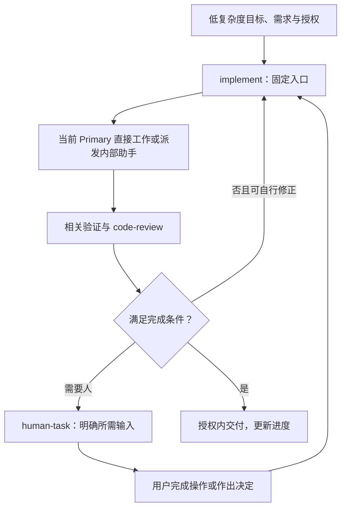
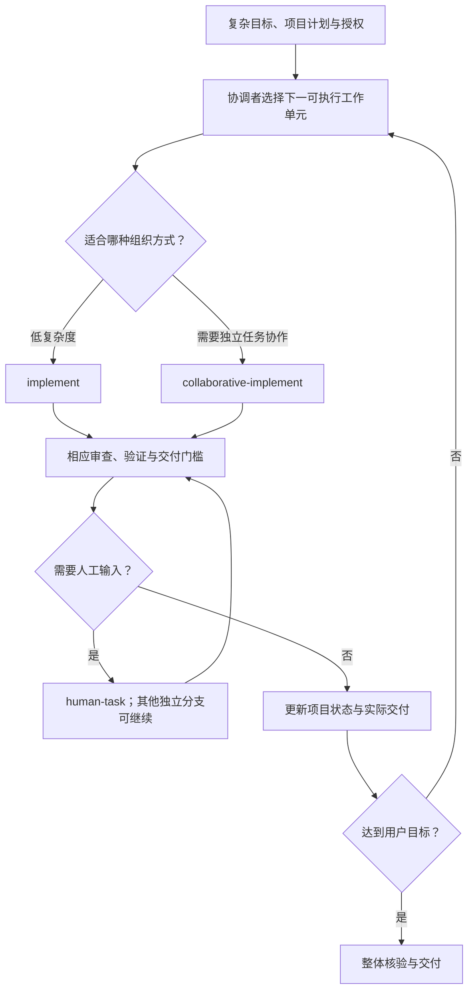
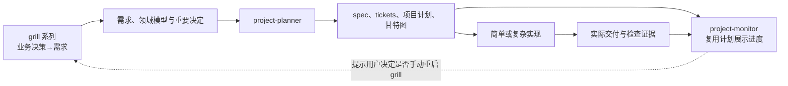
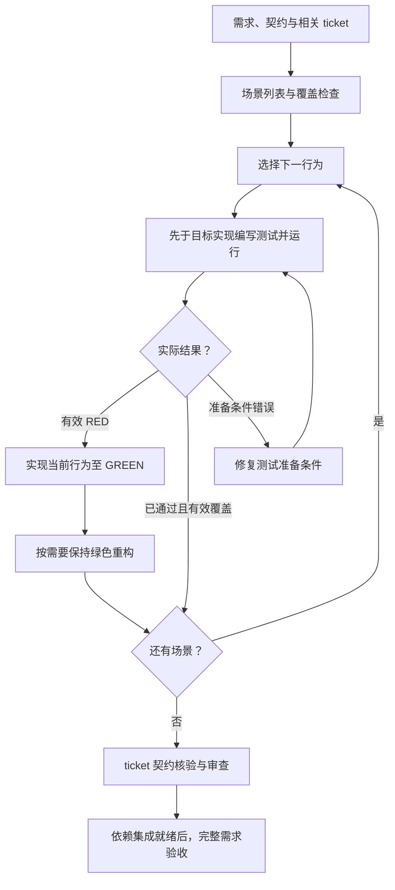

# 开源 Skill 库与开发工作流：发散设计正式版

版本：**1.0**\
创建日期：2026-10-08；定稿日期：2026-10-09（Asia/Shanghai）\
阶段：**发散已完成，等待收敛**\
定位：正式的发散成果与后续细节需求设计基线。

本文完整整理拟实现 skills 的理念、作用、已确认方向、可选方案、职责边界及收敛问题。用户已确认 TDD 发散完成，并要求以本文作为发散文档正式版本。此前持续维护发散文档的约定在本次定稿后完成；后续以正式版本开展收敛讨论，必要的修订应保留变更依据。

**正式版本不等于最终规格或实施授权。** 未确定的名称、路径、schema、人数、模型、触发条件和操作门槛统一留给收敛；本文不会自动改动现有项目规范、安装 skills、执行计划、创建任务、提交或发布。

此前讨论历史、现有项目基线和 Matt 全量调查保存在 [设计讨论记录](skill-library-design-notes.md)。当前设计方向以本文为准；旧稿中 grill 生成 spec、monitor 可在 planner 之前使用等设想不再作为当前方向。本地保留 Matt skills 与开源库分发是两项不同决定。

## 目录

- [1. 当前产品方向与维护方式](#1-当前产品方向与维护方式)
- [2. 发散状态总览](#2-发散状态总览)
- [3. 两条自动工作流的概念图](#3-两条自动工作流的概念图)
- [4. Grill 系列](#4-grill-系列)
- [5. Project Planner](#5-project-planner)
- [6. Project Monitor](#6-project-monitor)
- [7. Implement](#7-implement)
- [8. 协作实现入口](#8-协作实现入口)
- [9. PR Skill 与项目规范](#9-pr-skill-与项目规范)
- [10. Code Review](#10-code-review)
- [11. 宏观审查组与 Impact Review](#11-宏观审查组与-impact-review)
- [12. Environment Review](#12-environment-review)
- [13. Human Task](#13-human-task)
- [14. Handoff 与轻量经验交接](#14-handoff-与轻量经验交接)
- [15. 个性化改进 Skill](#15-个性化改进-skill)
- [16. TDD 与 Superpowers 调研](#16-tdd-与-superpowers-调研)
- [17. Domain Modeling 的贯穿方式](#17-domain-modeling-的贯穿方式)
- [18. 公共产物与可选辅助能力](#18-公共产物与可选辅助能力)
- [19. 收敛议题与问题索引](#19-收敛议题与问题索引)
- [20. 定稿记录、讨论历史与资料索引](#20-定稿记录讨论历史与资料索引)
- [21. 本地完整保留的 Matt Skills](#21-本地完整保留的-matt-skills)

## 1. 当前产品方向与维护方式

### 1.1 已明确的方向

1. 建立开源 skill 库，skill 主题采用英文，README 可提供中英等版本。
2. 当前聚焦软件开发，之后再提炼通用方法。
3. 首版在 Codex 应用会话中使用，允许中断后手动恢复；小脚本可支持状态、校验和图表，不以外部调度器为前提。
4. 用户设定目标、约束和操作授权后，普通工作自动推进；必须由人判断或操作时提供明确说明。
5. 简单工作流固定使用 implement；复杂工作流才根据工作单元选择简单实现或协作实现。
6. Grill 系列只做决策到需求，三个入口均只由用户手动触发。Planner 承担需求到 spec、tickets、项目计划和甘特图。
7. Project-monitor 在 project-planner 之后调用，复用已有甘特图展示实际进度，并关联决策图。
8. Review 的角色和 skill 都需要清晰边界，不自行扩大职责。职责边界是收敛重点；宏观组命名 project-audit，impact-review 已确认独立封装，用于变更方案落实前的审查。
9. Handoff 自动包含代码工作的轻量经验交接；由 retro 的环境改进思想形成 environment-review，明确加入宏观审查组。
10. 本地完整保留 diagnosing-bugs、research、triage、retro，不等于把原件放入新开源库。
11. TDD 从需求与契约组织测试场景，通过结构化展开、覆盖矩阵和反向检查提高完整性；对应目标行为实现前先写测试并运行，确认有效 RED 后实现至 GREEN，按需要保持绿色重构。
12. 完成门槛分为 ticket 的局部契约与完整需求的集成验收两层；已有行为通过有效测试时复用覆盖，不人为制造失败。

### 1.2 状态术语

| 标记 | 含义 |
| --- | --- |
| 发散完成，留待收敛 | 用户明确说明 idea 已足够；不主动重新展开内部机制，保留细节问题供后续。 |
| 边界留待收敛 | 用户要求将职责边界记录，之后集中细化；不把当前条目当最终检查表。 |
| 细节候选 | 可在收敛中选择的名字、路径或机制，不表示该 skill 仍需发散，也不等于已批准接口。 |
| 历史设想 | 曾讨论但已被后续确认修正的想法，仅用于追溯，不作为当前设计。 |
| 本地保留 | 用户级现有能力继续使用，不自动纳入新库实现/发布清单。 |

全部拟实现方向已完成发散。完成发散不代表细节需求、接口、验收、实现或权限变更已经完成；下一阶段是收敛。本次定稿不提前开展各 skill 的收敛访谈或生成实施计划。

### 1.3 正式版本的使用与维护

- 本文作为发散基线，收敛时按对应章节和问题编号逐项形成细节需求，不再把全部技能重新展开发散。
- 理念与已确认方向、参考机制、未定细节分别表达；问题编号可复用到后续需求设计。
- 发生设计修正时说明来源、影响和取代关系，不默默将候选升级为用户确认。
- 首次恢复或接手可先读取第 1、2、19 节及相关 skill；按需要查看研究与历史，不默认全文加载所有附件。
- 文档维护不扩大安装、替换、Git、外部发布或项目执行权限。

## 2. 发散状态总览

| 能力 / Skill | 当前方向 | 状态 |
| --- | --- | --- |
| grill-diverge | 用户手动触发，横向扩展业务构想、场景和选择空间 | 发散完成，留待收敛 |
| grill-converge | 用户手动触发，纵向深入既选方向，形成完整需求与相关草稿 | 发散完成，留待收敛 |
| auto-grill | 用户手动触发，授权内自主需求决策、审查与定稿 | 发散完成，留待收敛 |
| project-planner | 需求→spec/tickets/计划/甘特图 | 发散完成，拆分机制留待收敛 |
| project-monitor | planner 之后的地图与进度呈现 | 发散完成，留待收敛 |
| implement | 低复杂度目标的固定实现入口 | 发散完成，留待收敛 |
| collaborative-implement | 复杂项目协调与按工作单元路由；用户已确认名称 | 发散完成，留待收敛 |
| pr（名称候选）+ 项目规范 | 方法与规则同时保留，定义自动合并条件 | 发散完成，留待收敛 |
| code-review | 六方面局部审查，明确各审查者边界 | 发散完成，边界是收敛重点 |
| spec-review | 规格整体检查 | 发散完成，边界是收敛重点 |
| plan-review | 计划整体检查 | 发散完成，边界是收敛重点 |
| system-review | 集成系统整体检查 | 发散完成，边界是收敛重点 |
| architecture-review | 重大架构变化检查 | 发散完成，边界是收敛重点 |
| release-review | 发布准备检查 | 发散完成，边界是收敛重点 |
| impact-review | 变更落实前审查需求/规格草案，查业务影响与遗漏处理 | 发散完成，职责细节留待收敛 |
| environment-review | 由 retro 思想转化的环境改进宏观审查 | 用户确认加入；发散完成，边界留待收敛 |
| human-task | 人工操作/决定的清楚说明与回交 | 发散完成，留待收敛 |
| handoff | 可恢复交接、最小读取范围、轻量经验传递 | 发散完成，留待收敛 |
| customize | 融合使用习惯，扩展或重构 skill/工作流，用户已确认名称 | 发散完成，留待收敛 |
| tdd / test-driven-development（最终名称留待收敛） | 需求驱动场景，先测试再实现，按行为执行反馈循环与两层验收 | 发散完成，留待收敛 |
| 领域建模（共享能力） | 按已确认分工融入 grill、planner、monitor | 分工已确认；具体设计留待收敛，不另立新入口 |

本版本共有 **20 个拟实现 skill 方向**，全部发散完成；领域建模作为共享能力拆入已有 skills。Project-audit 是宏观组名，不额外计作一个执行 skill；该组包含七个 -review skills，各自职责边界留待收敛。最终入口名称和文件组织在收敛中确定。

## 3. 两条自动工作流的概念图

### 3.1 简单工作流固定使用 Implement

赞同这一划分：既然用户明确选择低复杂度路线，就无需每轮重新在简单与复杂入口之间选择。仍可按需要调用审查、交接或人工任务能力，不表示全程只能加载一份 skill。



若工作实际超出简单路线的约束，应报告变化，由已有授权策略或用户决定是否升级，不能默默创建复杂项目组织。具体升级条件留待收敛。

### 3.2 复杂工作流包含路由

复杂项目中不同工作单元可能需要不同组织成本。上层协调在当前授权和依赖/资源就绪条件下，选择由 implement 处理或创建协作工作。



路由发生在哪个入口、角色的实际写边界、task/worktree 的具体派发机制均留待收敛。图不是已经实现的执行算法，也不改变当前项目“用户合并/逐批授权”等政策。

### 3.3 需求与地图的前后关系



这也区分了“早期需求设计记录”和“有执行计划之后的项目地图”。前期仍可以保存决策草稿，不必因此提前调用 project-monitor。

## 4. Grill 系列

**状态：三个 skill 均已完成发散，详细设计留待收敛。** 三者只允许由用户手动触发；不能因为其他 skill 发现问题，就自动切换到 grill。

Auto-grill 中的 auto 指用户启动之后的自主决策过程，不表示自动触发。Planner、monitor 或实现者发现重大需求缺口时，应提供问题、影响和手动重启建议；无法安全推进的相关分支等待用户处理，其他已授权且不依赖该缺口的工作可继续。手动触发入口如何在最终平台落实，留待收敛，不将普通提示文字当作已经存在的技术拦截。

用户接受领域建模在 grill、planner、monitor 中的分工；后续将其拆入各 skill 的具体设计，不增加独立 domain-modeling 入口作为链路前提。

### 4.1 共同边界：只做需求设计

已明确：grill 系列完成业务决策到需求的工作，不把需求拆成 spec、tickets、实施任务或排程。后者属于 project-planner。

这里的“需求 / spec / ticket”是本库准备采用的分层约定，不宣称整个行业都用同一粒度：

- 需求：用户目标、场景、业务行为、规则、约束和非目标。
- spec：planner 将需求组织成可交付能力的规格，补清该交付的契约与验证要求。
- ticket：执行规格所需的有界工作单元。

Planner 如发现重大业务缺口，可以提出需要回到 grill 的问题，不应通过技术拆分自行增加新产品目标。普通技术选择如何授权则留到收敛。

### 4.2 Grill-diverge

**Idea：**横向扩展决策树。由 rough idea 出发发现用户、场景、问题、约束、替代方向与反例，一个问题可以引出新创意。

**需求方向：**容纳暂不选择的候选和未定问题；事实调查为探索提供依据；可视材料在帮助理解时使用；不迫使每条分支立即落成实施计划。

**理念解释：**“更接近横向”是讨论重点，不是要求严格 breadth-first 算法。发现重要新问题时可以局部深入，但仍以拓展需求空间为目标。

**留待收敛的问题：**

- GD-01：从哪些典型 rough idea 开始，哪些场景最需要主动发散？
- GD-02：如何记录被暂缓、反对或未验证的想法，避免后续误当确认需求？
- GD-03：用户希望 AI 对原方向挑战到什么程度，怎样保留用户真正目的？
- GD-04：何时建议转向收敛，用户怎样继续发散或结束？
- GD-05：初步材料以对话记录、需求草稿还是可视决策树呈现？
- GD-06：项目事实与产品问题怎样分工，什么时候需要研究/原型证据？

### 4.3 Grill-converge

**Idea：**纵向深入决策树的已选方向，补齐业务规则、场景边界、状态和例外，形成完整需求。

纵向深入不是“把任何可想象细节都规定完”。它还需要消除矛盾、减少未定选择、明确暂不做和可接受未知，直到需求具备后续拆分所需信息。

**已提出的文档流程：**自动生成需求及相关文档草稿，放入项目根目录 temp；讨论后展示用户；用户审核、确认需要生成的 ADR，再落实到 docs。**草稿不再命名为 draft-spec**，以免越过 planner 的边界。

路径候选（非最终命名契约）：

```text
temp/grill/<topic>/<run-id>/
  draft-requirements.md
  draft-domain-model.md
  draft-glossary.md
  proposed-adrs/<decision-slug>.md
  discussion-notes.md

docs/requirements/<topic>/requirements.md
docs/domain/<context>/domain-model.md
docs/domain/<context>/glossary.md
docs/adr/0001-<decision-slug>.md
```

示例不要求每次创建全部文件。是否拆 domain-model 与 glossary、最终路径和接纳版本，都留待收敛。

**留待收敛的问题：**

- GC-01：需求完成需要覆盖哪些业务信息，怎样记录仍需未来事实的决定？
- GC-02：草稿的最小集合、命名、版本、保留与定稿方式是什么？
- GC-03：需求、领域模型和 ADR 分别怎样审核、接纳？
- GC-04：哪些决定值得 ADR，哪些只进入需求或词汇表？
- GC-05：怎样把横向探索留下的候选转成选择，而不丢失重要依据？
- GC-06：对已有项目修改需求时，如何发现与现有模型/实现的冲突？

### 4.4 Auto-grill

**Idea：**用户给出构想，agent 在目标、约束和决策权限内自主完成需求决策，必要时查事实或提出少量问题，自行 review 后定稿。

**已确认权限方向：**授权内可自行定稿，重大未授权决定才询问。输出仍是需求与业务决定，不是自动完成 spec/tickets 或启动实现。

**留待收敛的问题：**

- AG-01：怎样表达自主决策范围和用户优先级，信息较少时允许什么假设？
- AG-02：哪些缺口可以默认，哪些业务取舍必须问？
- AG-03：自审如何发现矛盾、漏场景和擅自扩张，何时增加独立审查？
- AG-04：怎样标注由 agent 选择、经用户确认或仍未验证的事项？
- AG-05：用户审阅后怎样修改、局部重做或回到交互式 grill？
- AG-06：如何保留真正有帮助的提问方法，而不将固定问题数量/深度变成仪式？

## 5. Project Planner

**状态：发散完成，拆分机制留待收敛。** 输入/输出与职责方向已记录，算法与粒度细节在后续设计。

**Idea：**拿到需求后，组织 spec、tickets、完整项目计划与甘特图，保留当前直观呈现和可追溯排程能力。

**已吸收方向：**先需求覆盖，再识别可验证行为，最后包装独立交付；默认重视完整行为，但契约/迁移等允许有理由的其他切分；同源生成简报和图表；区分资源、依赖、未知事件和相对工作量。

**留待收敛的问题：**

- PP-01：一个需求如何对应多份 spec，一份 spec 如何对应多张 tickets？
- PP-02：规格与票据的边界、粒度、独立交付理由怎样检验？
- PP-03：普通技术取舍和重大业务缺口怎样处理？
- PP-04：当前 plan-input/schema 如何演进、兼容，并关联新增规格？
- PP-05：计划、简报、甘特图和审查怎样保持同源？
- PP-06：两种执行路线的依赖释放门槛和阶段验收怎样表达？
- PP-07：图表如何给 monitor 提供稳定接口，而不要求它重新排程？

## 6. Project Monitor

**状态：用户明确发散完成，后续收敛。** 下列问题保留为细节设计输入，不再主动重新展开发散。

**已明确：**在 planner 之后调用；直接复用 planner 已有甘特图，在其上展示实际进度。它是项目地图，不另画一份彼此漂移的计划。

**Idea：**从已有 spec/tickets/计划和真实交付证据呈现执行状态，结合长期决策图发现尚不能回答、已经解锁或受到变化影响的问题。

**展示方向：**节点的状态、阻塞、责任、实际验收和证据；决策与任务的关联；点击查看所需细节；根据进度发现下一可执行前沿。

**边界候选：**保留甘特图相对轴语义，不把进度叠加解释为现实时间预测；状态和完成百分比如何定义后续再谈；重大变更先明确重规划，而不是 monitor 悄悄改计划。

**留待收敛的问题：**

- PM-01：用户最常希望在地图中快速找到什么：进度、阻塞、下一步、未决问题还是整体风险？
- PM-02：任务状态、交付 gate、验证状态和可能的百分比怎样分别显示？
- PM-03：哪些实际事件更新进度，由谁提供和核验？
- PM-04：如何呈现未来决策，以及执行成果解锁决策的关系？
- PM-05：需求变化时，怎样区分进度更新与规划修订？
- PM-06：大项目折叠、过滤、局部图和 evidence drill-down 需要哪些能力？
- PM-07：domain-modeling 在模型变更时怎样介入，不把每次查进度变成重新建模？
- PM-08：没有 planner 产物时的使用提示，以及历史/实际版本怎样保持一致？

## 7. Implement

**状态：发散完成，后续收敛。**

**Idea：**低复杂度目标固定使用 implement，在当前分支由 Primary 完成或派发有界内部助手，统一整合、审查、验证与交付。

**方向：**低组织成本，保留完成证据；文件所有权、共享接口和 Git 操作由 Primary 协调；必要时调用 code-review、human-task、handoff 等，不每轮选择复杂入口。

**留待收敛的问题：**

- IM-01：输入可以是需求、spec、ticket 或何种组合？
- IM-02：什么条件直接执行，什么条件委派助手？
- IM-03：共享当前检出时的文件、进程与 Git 变更如何协调？
- IM-04：测试策略、审查组合、完成 gate 和失败处理怎样确定？
- IM-05：复杂度超出最初判断时如何升级，保留哪些授权和现有工作？

## 8. 协作实现入口

**状态：发散完成，用户已确认名称 collaborative-implement，详细设计留待收敛。**

**Idea：**复杂项目由 coordinator 推进用户目标，按当前工作单元选择 implement 或独立任务协作，管理隔离、依赖、审查、交付和阶段验收。

`project-implement` 是旧候选，用户觉得名称未体现协作。已采纳 collaborative-implement；以下仅保留命名选择的历史依据：

| 候选 | 意图 |
| --- | --- |
| `collaborative-implement` | 优先推荐，直接强调协作实现，并保留 implement 词根 |
| `team-implement` | 更短，强调任务团队，但项目协调含义较弱 |
| `orchestrate-implementation` | 更强调编排，名称较长 |

名称已经选定，但本轮文档讨论没有安装新入口或迁移已有 skills。

**留待收敛的问题：**

- CO-01：名称已定为 collaborative-implement；上层流程和单个执行入口的关系如何明确？
- CO-02：工作单元何时用 implement，何时创建独立任务？
- CO-03：coordinator、Task primary、内部助手的权限和报告边界？
- CO-04：授权一组规格后自动推进范围、PR/合并和阶段门槛？
- CO-05：中断恢复、重复派发防护、资源与身份核验？

## 9. PR Skill 与项目规范

**状态：发散完成，用户接受同时保留规范与 skill，细节待收敛。**

**Idea：**项目规范定义格式、证据和必要门槛；skill 组织准备、核验和允许的动作。结合现有完整规范与 Matt 的图示、前后证据、可逆性和影响范围表达。

**留待收敛的问题：**

- PR-01：最终 skill 名称，是否同时负责发布、更新和允许的自动合并？
- PR-02：库默认、项目规范和用户要求怎样保持单一来源与优先级？
- PR-03：审查版本、平台 required checks、集成结果和人工验收怎样共同决定自动合并？
- PR-04：双语/单语言、图示和证据的输出配置？
- PR-05：重试、目标分支变化、已有 PR 更新和清理边界？

现有人工合并规范未被改动，文档维护不等于实际合并授权。

## 10. Code Review

**状态：发散完成，用户要求职责边界作为收敛重点。** 六个审查者各自的责任、排除项、所需上下文、发现跨界问题的转交方式及整合者职责应重点细化，具体规则留待收敛。

**Idea：**项目推进过程中的局部变更审查，多个审查者各自聚焦明确方面。沿用 Google 检查设计、功能、复杂度、测试、文档与上下文的思路，针对当前交付，不演变成无边界的全库整顿。

### 10.1 六个职责方向（当前 idea，不是最终规则）

| 审查者 | 已罗列的重点 | 需要在收敛明确的边界 |
| --- | --- | --- |
| 需求与范围 | 当前规格/票据是否完整实现，是否扩大非目标 | 不自行重新定义产品目标 |
| 正确性与数据 | 状态、错误路径、并发、数据一致性 | 当前变化影响的行为和相关消费者如何确定 |
| 设计与规范 | 职责、接口、复杂度、重复、项目编码规则 | 不凭个人偏好发起无关宏观重构 |
| 验证质量 | 测试/证据有效性、漏检与错误断言 | 不无条件另建全项目测试战略 |
| 安全与隐私 | 权限、输入、秘密信息和数据边界 | 相关风险评估的深度和授权操作范围 |
| 性能与运行 | 性能、资源、观测、部署与恢复 | 本次影响相关的运行问题，何时移交宏观审查 |

必要上下文不等于扩大任务：判断本次改动可能需要看调用方、完整文件或契约；被当前变化触发的外部回归仍可能属于本次审查。与此次交付无关的旧问题可以记录线索，不能擅自全面修复或调查。

### 10.2 留待收敛的问题

- CR-01：如何用输入/输出、检查对象、允许读取和禁止扩张来定义每个角色？
- CR-02：重叠问题由谁负责主判，如何避免漏项和重复结论？
- CR-03：何时转给某个宏观审查，仅提线索还是正式触发？
- CR-04：怎样区分新缺陷、当前改动引发的回归和无关旧问题？
- CR-05：覆盖范围、快照、严重度、证据不足和未完成检查怎样报告？
- CR-06：按规模选择审查者、实际并发和模型；2/4/6 是此前建议而非已定参数。

## 11. 宏观审查组与 Impact Review

**当前确认：**project-audit 的七个宏观 skill 均已完成发散，等待收敛。职责边界同样是收敛重点：明确触发场景、主要问题、排除项、证据输入、发现跨界问题时的报告/转交方式，避免每个审查都演变成相同的全库检查。

**技能组正式英文名：project-audit，用户已采纳。** 该名称强调从项目全局核验设计、计划、系统、发布、环境及变更方案；组内保留各个 -review 名称，与局部 code-review 区分。这里的 audit 指工程审视，不宣称提供正式合规认证，也不代表必须增加一个同名调度 skill。此前 engineering-audit、holistic-review 只保留为命名历史。

Spec、plan、system、architecture、release、impact 六个方向在本章记录；environment-review 的完整 idea 在第 12 节。七者均属 project-audit，边界细节留待收敛。

用户认可宏观检查的重要性，要求各 skill 都有清晰边界。这些边界集中留待收敛，下面保存各自 idea 与问题，不将全部检查强制加入每次任务。

### 11.1 Spec-review

**Idea：**检查 planner 形成的规格能否忠实承接需求，以及完整、连贯、可实施、可验证。随着职责修正，它位于 planner 的 spec 产出之后，不应要求 grill 提前交付 spec。

**待收敛：**SR-01 输入原始需求和规格的覆盖关系；SR-02 缺业务决定与缺技术细化如何分别退回；SR-03 与 code-review 需求轴、plan-review 的边界；SR-04 已确认作为 skill，其独立调用与 planner 流程衔接如何组织。

### 11.2 Plan-review

**Idea：**检查整体计划的任务覆盖、重复、粒度、依赖、资源、容量、阶段门槛与甘特图语义。

**待收敛：**PLR-01 检查计划而非替代需求设计；PLR-02 如何审任务组合和拆分理由；PLR-03 排程一致性与实际视觉检查；PLR-04 对 spec-review 结论的使用与变更重审。

### 11.3 System-review

**Idea：**一组实际交付组合后的端到端与系统级正确性，发现局部任务检查难捕获的契约、状态和数据问题。

**待收敛：**SYR-01 审查哪组需求和集成版本；SYR-02 功能组合与非功能范围；SYR-03 与 architecture/release/environment 的职责边界；SYR-04 对遗漏与未验证如何形成后续工作。

### 11.4 Architecture-review

**Idea：**重大结构变化或选择的评估，围绕业务约束和具体质量场景比较方案、职责、耦合、数据所有权及取舍。

**待收敛：**AR-01 重大变化的触发条件；AR-02 方案评估与已实现系统审查如何区分；AR-03 与领域模型/ADR 的关系；AR-04 如何裁剪正式架构评估方法而不夸大保障。

### 11.5 Release-review

**Idea：**实际发布前检查兼容、配置、迁移、运行观测与发布/回滚准备。

**待收敛：**RR-01 不把 PR 合并等同生产发布；RR-02 与 code-review、system-review、pr 的结果衔接；RR-03 操作权限和必要人工环节；RR-04 不同部署环境的检查范围。

### 11.6 Impact-review

**状态：用户明确宣布发散完成；独立形式、变更前审查用途已确认，职责边界与交付结构留待收敛。**

**用户意图：**希望修改需求或规格时，在落实草案之前 review 它是否完善、合适。尤其检查：哪些业务逻辑会因此变化，但新方案没有计划处理这些变化？确认方案后，各图的具体修改交给 monitor。

**已确定独立封装。** 此前 monitor 模式/共享方法的替代包装不再是当前待选路线；必要的通用方法仍可共享，但不能以此取消已确认的入口。

**助手补充的职责建议：**对比当前需求/规格与变更草案，追踪规则、对象状态、关联业务、接口与数据语义的变化，检查草案有无对应处理、兼容/迁移安排与验证。它可以读取当前计划/代码/图作为证据，不因阅读就负责改这些产物。证据不足时应标为未知，不能把“未读到处理”自动当成确定遗漏。

例如将“取消订单立即退款”改为“审核后退款”，除了取消入口，还要检查待审核状态、退款触发、重复申请、用户可见结果和已有订单如何处理。如果草案只写了新增审核页，却没有处理这些业务影响，应在落实前指出。

**衔接方向：**变更草案→impact-review→补齐/确认方案→由对应职责更新需求、规格和必要计划→monitor 同步各图。Monitor 依据已确认内容更新呈现；如果依赖/任务变化需要重新规划，仍由 planner 处理，不让图表更新过程隐式重定义业务或排程。

**待收敛：**IR-01 当前基线、草案与审查版本怎样确定；IR-02 规则变化与遗漏处理如何提供具体证据；IR-03 与 spec-review/architecture-review/plan-review 的边界；IR-04 哪些既有测试/证据会失效；IR-05 review 结论与用户确认的区别；IR-06 方案被接受后的记录与 monitor 衔接。

## 12. Environment Review

**状态：用户确认加入宏观审查技能组，发散完成，详细设计与边界留待收敛。**

用户将 retro 分成经验交接与环境改进，已确认将其环境改进思想转化为 `environment-review`。经验部分仍归 handoff 自动轻量提炼；本地完整 retro 的保留记录见末章，文档讨论没有覆盖该安装。

Project-audit 当前共有七个 skill，包括已确认独立封装的 impact-review；environment-review 已确定进入该组。

**Idea：**评估 agent 工作环境是否支持可靠、低成本的工程：导航、指令组织、工具能力、日志、可运行检查、测试环境与反馈效率。针对已观察到的摩擦提出改进，而不是每次都扩展规范。

**可用输入：**真实会话发现、handoff 中的经验、重复失败、现有自动检查与工具配置。将确定事实、待验证原因、改进建议与已实施改进分开。

**留待收敛的问题：**

- ER-01：已确认作为 environment-review 加入宏观组；如何定义它与其他审查的边界？
- ER-02：什么时候触发，是否只针对反复出现或影响较大的问题？
- ER-03：项目工具、用户级环境、agent 指令和运行平台分别能检查/修改到什么范围？
- ER-04：仅提出改进还是在已有授权内执行，怎样验证改进效果？
- ER-05：如何避免把每次偶发错误写成永久约束，形成新的上下文负担？
- ER-06：将 retro 的环境改进思想转成新库设计；如何与本地完整 retro 及 handoff 轻量经验提取互补？

## 13. Human Task

**状态：发散完成，详细设计留待收敛。**

**Idea：**文档优先的人工任务说明，让用户理解要做什么、为什么、在哪里做、怎样确认成功，以及如何把结果交回。

包括操作和决策两种任务：前者给具体步骤，后者给选项、取舍、推荐与所需答案。必要时可生成稳定可复用的向导，不默认要求 Bash。

**留待收敛：**HT-01 最终名称；HT-02 说明结构和位置；HT-03 成功证据与回交；HT-04 阻塞分支恢复；HT-05 界面变化、未知步骤、秘密值和风险操作如何说明。

## 14. Handoff 与轻量经验交接

**状态：发散完成，详细设计留待收敛。用户明确保留自动运行轻量 retro 的方向。**

### 14.1 Idea

交接目标、授权、真实状态、下一步与最小充分阅读范围。摘要、条件引用和历史证据分层，不通过把全文堆得更长来解决 100k+ 上下文问题。

### 14.2 Retro 的经验部分

代码任务交接时，自动提炼对下一会话有用的经验：已验证事实、失败尝试和条件、避免重复踩坑的相关信息。不要求用户显式运行保留的完整 retro，也不依赖它必然能被其他 skill 自动触发。

用户举例：Windows 沙箱中的某些命令可能需要在沙箱外执行。应交接的是具体环境、观察到的失败、验证过的替代方式及当时的权限条件。**这不是把历史成功升级成未来 agent 的通用越权许可。** 接手者仍按当前沙箱、授权和工具审查判断；不能以经验为由静默绕过限制。

### 14.3 留待收敛

- HO-01：摘要、必读、按条件读、历史引用的结构和存放方式。
- HO-02：代码/非代码任务怎样判别，何时触发轻量经验提取。
- HO-03：如何标注事实/猜测、适用环境、有效期和是否需要重新验证。
- HO-04：真实分支、工作者活动、审查版本和已有授权的恢复核验。
- HO-05：主动读取与自动注入的上下文成本怎样测量和控制。
- HO-06：经验发现怎样进入 environment-review，避免自动改规范。

## 15. 个性化改进 Skill

**状态：用户明确发散完成，详细设计留待收敛。** 名称 customize 已确认，三条适配路线已采纳。

**名称：customize。** 此前 customize-skills、adapt-skills、improve-skills 为历史候选，不再作为待选名称。

### 15.1 Idea 与可能场景

核心需求是帮助用户融合自己的使用习惯与本库的方法，而不是只开放几项风格参数。既可扩展某个 skill，也可改变工作流中能力之间的衔接。

**用户给出的场景：**完成项目计划后，把 tickets 作为 GitHub Issues 发布；在现有 skill 思想上加入个人内容。若用户方案与原方法冲突，要清楚展示双方优劣，并给出可行的 merge 或 refactor 方案。

- 调整提问风格、主动程度、报告详细度与语言。
- 调整审查重点、验证策略、文档模板和项目默认值。
- 将真实使用反馈转成窄而有证据的改进。
- 支持工作流插入、项目级偏好和用户级偏好，并保留原版与自定义版本关系。
- 改进后检查能力、调用边界和行为没有意外退化。

### 15.2 已确认路线与实现方式

**用户已采纳的三条适配路线：**

| 路线 | 适用情况 |
| --- | --- |
| 配置或局部修改 | 调整语言、风格、模板、审查重点等，不改变核心方法 |
| 新增工作流环节 | 在稳定阶段插入有明确输入/输出及失败处理的能力，例如计划后发布 GitHub Issues |
| 明确派生或重构 | 核心思想发生变化时，比较双方取舍，给出 merge/refactor 方案，记录语义变化、兼容与回退 |

下表保留此前探索的实现方式，具体组织留待收敛，不再重新讨论是否需要这三条路线。

| 方式 | 可探索的价值与问题 |
| --- | --- |
| 参数/配置 | 保持主要方法，调整语言、风格、模型或模板；哪些选项值得配置？ |
| 自定义派生版本 | 需要改变方法时生成可追踪版本；怎样避免同名与更新覆盖？ |
| 使用反馈驱动修订 | agent 提出改进，用户选择；怎样防止一次失败变成普遍规则？ |
| 有明确输入/输出的新增环节 | 在某个稳定阶段后消费已有产物；是否阻塞后续工作由用户需求确定，不默认引入所有项目必需环节 |
| 明确派生的工作流重构 | 当思想冲突不能通过参数/插入解决时，保留原版并建立可解释的新方案；不把不同语义冒充成无损合并 |

这些不是已存在的通用 override 功能。实施时需核实平台能否实际读取配置；可以由 skill 显式读项目配置或生成自定义版本，不能只创建文件就宣称覆盖生效。

**助手补充的适配思路（候选，非已批准机制）：**

1. 先识别用户目标、原方法的目的及双方契约：输入、输出、职责、状态、触发和所需权限。
2. 展示差异与取舍。原版的优点不能只用“更规范”表达，用户方案的缺点也不能只用“偏离库思想”表达；应说明具体会得到/失去什么、维护和运行成本如何变化。
3. 能低侵入插入时，优先新增有界环节；需要改变已有语义时，提出明确派生版或重构方案，展示影响范围和兼容方式。原方法本身也可以改进，不把原版当绝对正确。
4. 在用户已授权的定制范围内实施，并检查原有核心行为、上下游衔接和新能力。重大范围/权限改变需要先说明并取得相应授权；不能借定制绕过三种 grill 的手动触发边界。
5. 提供版本记录、可审阅差异与回退方式，避免上游更新悄悄覆盖个人习惯，或个人定制静默破坏公共库。

**GitHub Issues 场景的探索示例：**planner 保持生成 spec/tickets/计划的原职责；新增发布环节消费已接纳的 tickets，维护 ticket 与 issue 的映射。它可以只同步展示，也可以成为用户授权的任务入口，需要明确哪一方是状态权威。重复运行不应重复创建 issue；本地修改与远端修改的冲突、部分失败后的恢复、是否允许编辑/关闭现有 issue 均需说明。用户只是举例，本轮没有创建任何 issue，也未将此环节定为新库核心必需项。

**思想冲突的示例：**若用户希望“monitor 发现需求缺口后自动启动 auto-grill”，这与当前手动触发边界相悖。可比较保留用户业务决策控制与无人值守自主推进各自的收益/成本；merge 可以是 monitor 整理问题并提供手动启动入口，refactor 可以是用户明确选择的自主决策派生工作流。后者改变了触发与授权契约，必须明确标注，不能称为保持原思想的无损改动。

### 15.3 留待收敛的问题

- CU-01：已明确工作流插入和思想融合两类场景；首版支持哪一层次和哪些输入方式？
- CU-02：同时支持用户级/项目级还是先一种？
- CU-03：用户提出改变还是 agent 主动提议，确认门槛怎样设置？
- CU-04：已明确不只参数/模板，还包括步骤和思想融合；如何区分兼容扩展与需要派生版的语义变化？
- CU-05：版本、备份、撤销、上游更新和冲突怎样处理？
- CU-06：怎样检验真实行为而不只检查文案？
- CU-07：明确保护本地完整保留的四个 Matt skills，避免覆盖它们。
- CU-08：如何展示双方优劣、多个 merge/refactor 方案及各自影响，而非仅判断服从原版？
- CU-09：新增环节如何声明输入、输出、失败策略、状态权威与外部操作权限？
- CU-10：定制作用于个人安装、特定项目或公共库提案时，分别如何验证、升级和撤销？

典型场景与三条适配路线已明确。自动自我学习、通用插件框架及配置覆盖的实际机制留待收敛，不把它们当已经存在的能力。

## 16. TDD 与 Superpowers 调研

**状态：发散完成，用户于 2026-10-09 确认本轮设计方向，具体机制留待收敛。** 最终英文名称暂以 tdd / test-driven-development 表示。

### 16.1 理念与已确认方向

从需求与契约生成测试场景，让测试先于对应目标行为的实现，并用实际反馈推进开发。测试是规则的可验证表达，不能通过读取实现结果反推业务要求。测试通过也不能代替需求覆盖检查。

已形成的方向包括：

1. 需求与 ticket 可以多对多；按 ticket 组织场景，同时保留原始需求、规格与共享约束的来源。
2. 复杂项目在 planner 后准备测试设计；简单 implement 在当前工作单元内轻量准备，不强制先运行完整 planner。
3. 先形成充分且可调整的场景列表，实际实现优先按一个行为一个反馈循环推进。接口稳定的业务验收测试可以提前准备；具体产出时机留待收敛。
4. 对应行为实现前先编写并运行测试。因目标行为缺失/错误而失败，才形成有效 RED；随后实现至 GREEN，再按需要保持绿色重构。
5. 行为已正确且测试有效时复用覆盖，不为流程故意破坏代码。纯重构、文档、配置等采用适当验证。
6. 完成门槛分为 ticket 的局部契约与完整需求的集成验收两层，这是用户明确要求保留的设计。
7. 测试质量、覆盖和证据需要独立核验；TDD 不是需求无遗漏或系统无缺陷的保证。

### 16.2 在现有工作流中的分工

| 阶段 | 职责 | 关键边界 |
| --- | --- | --- |
| Grill | 明确业务对象、状态、规则、约束与非目标 | 只由用户手动触发；不拆技术 spec/tickets |
| Planner | 将需求组织为 spec/tickets/计划，明确契约、依赖和完成条件 | 不因拆分或验证需要新增业务规则 |
| TDD 准备 | 从需求与契约形成覆盖义务、场景、预期和测试归属 | 已设计不等于已运行或已经 RED |
| 实际执行者 | 先写当前行为测试并运行，再实现该行为，按反馈循环推进 | 不能先完成目标行为再补测试，并将其记录为测试先行 |
| Review 与任务交付 | 审视覆盖、断言、实现和真实证据，核对 ticket 契约 | 不凭当前测试全部通过就认定完整需求实现 |
| 集成验收 | 验证跨 ticket 的完整业务行为和共享约束 | 明确负责单元、依赖和验收版本 |



建议将 TDD 能力组织为准备与执行两个使用阶段，暂不增加额外测试规划 skill。最终模式和接口在收敛中确定。

执行者对测试与实现负责；coordinator 消费精简结果与证据，不默认重新读取每个微循环。现有 code-review 的验证质量职责承担独立审视，不新增每循环审查者。

### 16.3 输入与最小测试设计产物

按需读取相关需求、领域模型、规格、ticket、依赖、已有接口与测试，避免默认扫描全库。复用已确认的接口与授权，不要求每个测试重新询问用户；重大业务/契约缺口则报告问题，不自动启动 grill。

产物是一份按 ticket 组织的可调整场景列表，可以放在 ticket 内或有界附属文档。现有测试足以验证同一契约时直接引用，不复制。每项至少表达来源、前置状态、操作、预期、观察边界、要捕获的错误、测试层次、负责人和当前验证状态。

| 字段 | 示例，非最终 schema |
| --- | --- |
| 来源 | R2 / 对应 spec / 当前 ticket：余额不足不得扣款 |
| 测试边界 | 已约定的账户扣款接口 |
| 前置与操作 | 余额 10000 分，申请扣款 13000 分 |
| 预期 | 拒绝，余额仍为 10000 分，无实际扣款 |
| 要捕获的错误 | 缺少余额校验，或拒绝后仍发生扣款 |
| 层次与归属 | 当前模块行为测试由当前 ticket 负责，真实持久化链路另有集成验证 |
| 初始状态 | 已设计，未运行 |

预期值来源于已确认规则、独立手算或可信样本，不用被测代码或其辅助函数计算答案。一个测试关注一个逻辑行为，可包含多个必要断言，例如拒绝结果与余额不变。

测试选择能观察目标行为的公开边界，如函数、模块接口、API 或用户操作，不强制所有测试都走端到端。外部依赖可采用替身，但待验证的业务逻辑保持真实；调用次数/参数本身属于业务副作用契约时可以验证，不能只测试替身是否存在。

### 16.4 如何提高场景覆盖完整性

采用“需求覆盖义务→结构化展开→追溯矩阵→反向与风险检查”。目的在于让重要规则与风险得到可核验覆盖，显式保留未知和剩余风险；复杂系统不能承诺穷尽全部输入与组合。

#### 16.4.1 从原始需求提取覆盖义务

从需求、领域模型、重要决定、接口契约和质量约束提取允许/拒绝行为、状态转换、不变量、错误与恢复结果，再关联 spec、tickets 与场景。义务是既有规则的拆解，不是新业务决定；不能只从可能已经漏项的 ticket 标题出发。

每条重要义务需要有对应场景或明确验证安排。跨 ticket 义务必须有整体验收归属。预期不明确时记录需求歧义与影响，不自行生成业务答案。

#### 16.4.2 根据行为选择展开方法

等价类、边界、决策表与状态转换属于成熟的黑盒设计方法；下表为本库按风险使用它们及其他场景视角的方向。[ISTQB CTFL v4.0.1，第 4.2 节](https://istqb.org/wp-content/uploads/2024/11/ISTQB_CTFL_Syllabus_v4.0.1.pdf)

| 视角 | 场景展开方向 |
| --- | --- |
| 等价类 | 区分不同处理方式的有效/无效输入类别，选择代表，避免大量重复正常输入 |
| 边界 | 覆盖阈值、数量、容量、时间的临界值及邻近值，例如余额与扣款额差为 -1、0、1 分 |
| 条件组合 | 多条件业务规则列出可行组合与预期，避免仅测每个条件独立取值 |
| 状态与事件 | 合法/非法转换、重复操作、必要序列、取消与恢复 |
| 跨模块与数据 | 接口、持久化、旧数据兼容及业务不变量的集成场景 |
| 失败与恢复 | 实际依赖风险中的超时、部分成功、重试、回滚结果 |
| 权限与非功能 | 需求涉及的授权边界、性能、资源和可靠性目标 |

不是每个简单任务都需要全部视角。组合很多时排除业务不可行项，按风险选择策略并记录未覆盖项；两两组合等压缩方法不等于覆盖三项以上交互，高风险规则需针对性补充。

#### 16.4.3 覆盖矩阵与状态

义务关联场景、测试层次与负责单元，分别标注已设计、未运行、已验证、被依赖阻塞、尚未覆盖、不适用及原因。场景数量与代码覆盖率都不能冒充需求验证完成度。

| 覆盖义务 | 场景 | 预期与归属 |
| --- | --- | --- |
| 余额大于扣款额 | 余额 10000，扣款 3000 | 成功剩 7000，当前 ticket |
| 恰好可扣完 | 余额 10000，扣款 10000 | 成功剩 0，当前 ticket |
| 超过余额 | 余额 10000，扣款 10001 | 拒绝且余额不变，当前 ticket |
| 拒绝没有资金副作用 | 真实相关链路发起不足余额扣款 | 无实际扣款，集成验收单元 |

无效金额、未知账户、并发扣款等有来源规则时加入对应义务；尚无规则却明显影响业务时作为待明确问题，不能把猜测直接定稿。

#### 16.4.4 独立反向检查与准备门槛

从原始需求反向检查未进入列表的行为、缺少代表的边界与没有验收归属的整体行为；再问哪类真实错误可能让当前测试全部通过。高风险目标可采用独立视角，具体安排留待收敛，不固定人数或额外 skill。

测试形成后检查断言独立性、目标分支、替身遮蔽与遗漏副作用。代码/分支覆盖和窄范围变异检查是补充，不能证明代码中未实现的需求已满足。

准备门槛的方向：重要义务有场景或验证安排，适用边界/状态/条件组合经过考虑，跨任务验收有归属，未知与剩余风险可见。影响当前执行的高风险未决先解决或等待用户决策，不能标成已覆盖。

### 16.5 测试先行与有效 RED

RED 是测试在目标行为实现之前实际运行的结果；测试预期仍由需求决定。此前“实现开始后”容易误解为先实现再找遗漏，正式版本采用下面的明确顺序：

**需求与契约→场景与覆盖检查→选择当前行为→在该行为实现前编写测试→运行当前基线→有效 RED→实现至 GREEN→必要重构→下一场景。**

先确认命令、依赖、可运行接口和相关既有测试基线。已有失败按具体检查记录，不顺带扩大修复范围。新接口可建立最小可调用结构，但不提前实现目标行为；缺符号或编译失败暴露准备缺口，不能直接证明业务断言有效。

| 运行结果 | 处理 |
| --- | --- |
| 因目标行为缺失/错误而断言失败 | 有效 RED，保留预期与实际差异，开始该行为的实现 |
| 导入、环境、测试发现、fixture 或替身错误 | 修复准备条件后重跑 |
| 测试通过 | 确认真实目标与有效断言，若已有行为满足要求则标为已覆盖并复用 |
| 不稳定或多个无关故障混杂 | 隔离时间、随机性、共享状态或依赖问题后重跑 |

通过仅证明当前断言成立；未测到目标或断言过弱时不能认定业务已覆盖。已有正确行为不人为破坏以制造 RED。必要的窄范围测试有效性检查应与真实开发 RED 区分。

先完成目标行为再补测试可以提供回归证据，但不能记录为该行为的测试先行。Review 继续承担独立质量与遗漏审查，不是获得首次 RED 的阶段。

### 16.6 GREEN 与必要重构

GREEN：只实现当前行为所需内容，运行当前及可能受影响的已有测试。不能删除断言、跳过失败、用测试环境特判或将期望改成当前结果来获得通过。测试确有错误时，依据权威规则修正、说明原因并重新运行。

已知后续要求仍留在列表中，第一项通过不能宣告 ticket 完成。测试顺序和列表可根据反馈调整；发现新业务取舍则报告需求问题，不以补测试扩张业务目标。

REFACTOR：GREEN 后按需要小步整理重复、命名、职责和测试难度，保持受影响测试绿色；没有实际问题时直接继续。重构不加入新行为；重大接口/架构变化进入对应设计或审查，不借重构越过范围。

本库方向采用循环内必要小步重构，并保留交付阶段 code-review；与本地 Matt tdd 将重构放到 review 的方式区分。没有因此改写本地安装。Canonical TDD 先列场景、逐项写测试、使其通过、可选重构，并允许追加场景。[Kent Beck 的 Canon TDD](https://newsletter.kentbeck.com/p/canon-tdd)、[Fowler 的 TDD 说明](https://www.martinfowler.com/bliki/TestDrivenDevelopment.html)

### 16.7 两个循环的具体例子

假设已有可调用扣款接口，当前返回原余额。已确认规则：余额充足时正确扣款；余额不足时拒绝且不改变余额。金额以分表示，未增加其他业务规则。

| 步骤 | 测试与观察 | 实现动作 |
| --- | --- | --- |
| RED 1 | 余额 10000，扣款 3000，应剩 7000；当前仍为 10000，断言失败 | 尚未实现正常扣款 |
| GREEN 1 | 当前场景及相关回归通过 | 实现正常扣款及返回结果 |
| RED 2 | 余额 10000，扣款 13000，应拒绝且余额不变；当前仅做减法会得到 -3000，断言失败 | 尚未实现不足时拒绝 |
| GREEN 2 | 两个场景及相关回归通过 | 增加校验，拒绝且不改变余额 |
| REFACTOR | 行为不变，测试保持绿色 | 按需要整理结果构造或命名，无问题不强行重构 |
| 边界补充 | 余额 10000，扣款 10000，应成功剩 0 | 可能已通过，保留覆盖，不制造失败 |

如果实际接口已正确拒绝不足余额，直接确认覆盖，不假设必然有第二个 RED。7000 等预期来自需求与独立推导，不因实际运行输出改变。

### 16.8 完成证据与两层验收

**用户明确采纳：ticket 完成与完整需求完成两层门槛。**

循环中保留测试标识、命令、基线/工作状态、RED 失败原因、GREEN/重构结果，可引用日志，不必写长篇复盘。已设计、已观察 RED、已覆盖、被依赖阻塞、不适用应分开记录。

Ticket 完成：核对承担的场景与来源，运行项目规定检查及必要回归，代码与测试共同交付，审查和证据对应实际版本，披露已知失败/未验证项。后续变更使证据失效时重验证。微循环聚焦反馈，阶段结束遵守项目完整检查。

完整需求完成：相关 tickets 集成后验证完整业务流程与共享约束。一个测试可以服务多个需求或层次，避免重复三套断言；各 ticket 通过不能替代整体结果。

例如已支付未发货订单取消并退款，且重复取消不得重复退款：状态 ticket 验证允许/拒绝转换；退款 ticket 验证幂等资金操作；集成工作单元验证真实取消流程与重复取消结果。局部通过不意味着整体完成。

跨 ticket 验收明确归属、依赖、版本与启用时机；依赖未就绪的场景可先设计，不虚报通过，不通过临时禁用来宣布完成。共享测试文件与环境需要明确所有者。

### 16.9 非行为任务与已有正确行为

- 新功能/bug 的可验证行为优先采用测试驱动；具体默认与例外门槛留待收敛。
- 已有正确行为复用有效测试，不重复实现或制造失败。
- 纯重构确认绿色回归基线，以行为保持为证据；有必要时补特征测试，不要求新 RED。
- 文档、配置、环境与探索原型选择行为检查、构建/配置验证或人工验收，记录不用新 RED 的理由。

新库的验证策略不自动改动当前项目政策。完整场景设计与逐项测试代码可以分阶段形成；稳定接口的验收测试可提前准备，具体时机在收敛中定义。

### 16.10 上游调查、选择依据与证据边界

Superpowers 调查固定于 obra/superpowers 提交 `8ca22dba9a94f28898bbce59f2537ff4d87c747d`（v6.4.2），只读源码，完整记录见 [独立研究](../research/superpowers-tdd-workflow-2026-10-08.md)。

上游对新功能、bug、重构和行为变化默认强制 TDD，原型、生成代码与配置的例外要求询问；先写实现时要求删除重做。作者旨在减少后补测试偏向实现、未证明测试能发现错误，以及 agent 跳过反馈。该政策不是任意平台技术钩子保证，更不是对所有模型的量化效果证明。[上游 TDD](https://github.com/obra/superpowers/blob/8ca22dba9a94f28898bbce59f2537ff4d87c747d/skills/test-driven-development/SKILL.md)

本库吸收测试先行、真实失败、独立预期和反馈证据，按任务选择验证，不机械删除既有用户工作。披露无关失败与授权修复它分别处理。上游计划模板的 function not defined 与 TDD 排除报错的措辞存在张力，本库区分接口准备失败和业务断言失败。完整套件是阶段完成检查，不解读为每个小循环全量运行。

可借鉴的其他方向仍保留：

1. 完成声明有适用版本的真实证据，按变化复用或重验证。[完成前验证](https://github.com/obra/superpowers/blob/8ca22dba9a94f28898bbce59f2537ff4d87c747d/skills/verification-before-completion/SKILL.md)
2. 任务输入保留规格、全局约束、接口与验证契约。[计划编写](https://github.com/obra/superpowers/blob/8ca22dba9a94f28898bbce59f2537ff4d87c747d/skills/writing-plans/SKILL.md)
3. 使用有界审查包，固定 base/head、diff、需求和报告。该上游版本是一位任务审查者依次审 spec 与质量，另有整分支审查，不能描述为两位并行。[任务审查模板](https://github.com/obra/superpowers/blob/8ca22dba9a94f28898bbce59f2537ff4d87c747d/skills/subagent-driven-development/task-reviewer-prompt.md)
4. 恢复核对台账，普通授权内判断保留依据，避免重派；上游自主政策不替代本库业务授权。[子代理工作流](https://github.com/obra/superpowers/blob/8ca22dba9a94f28898bbce59f2537ff4d87c747d/skills/subagent-driven-development/SKILL.md)
5. 用真实/压力场景与基线比较验证 skill 的行为改进，适用于 customize；不因指令更长就认为更好。[Skill 行为验证](https://github.com/obra/superpowers/blob/8ca22dba9a94f28898bbce59f2537ff4d87c747d/skills/writing-skills/SKILL.md)

测试质量参考还强调测试捕获具体错误、真实行为、独立预期与窄范围变异检查；不为琐碎转发或人类 prose 机械造测试。[有效测试](https://github.com/obra/superpowers/blob/8ca22dba9a94f28898bbce59f2537ff4d87c747d/skills/test-driven-development/writing-good-tests.md)

所有来源用于解释方法与取舍，不构成本库已经独立评估通过的证据。TDD 仍需覆盖检查、适当审查与实际项目验证。

### 16.11 留待收敛的问题

既有 TD 编号保留，方向已接受的问题改为机制设计，不重复询问是否采纳。

- TD-01：新功能/bug 的默认使用规则与用户配置怎样表达？
- TD-02：不同任务的验证选择与例外记录如何定义？
- TD-03：有效 RED、环境错误、弱断言和不稳定结果怎样分类与留证？
- TD-04：新接口准备、已有正确行为、先探索后实现的基线怎样核验？
- TD-05：微循环、ticket、集成阶段分别运行哪些检查，证据何时失效？
- TD-06：必要局部重构与独立设计/审查的边界如何明确？
- TD-07：日志与完成证据的最小格式、引用和版本绑定如何组织？
- TD-08：具体模型/任务的实测、风险裁剪及策略覆盖如何安排？
- TD-09：已确认两层门槛，准备/执行/验收的输入输出如何衔接？
- TD-10：可读场景与测试代码的产出、位置及未运行标记如何定义？
- TD-11：跨 ticket 验收、共享文件和环境如何分配所有权？
- TD-12：需求/spec/ticket/场景/测试的多对多追溯如何维护？
- TD-13：重构、文档、配置和原型怎样记录合适验证与理由？
- TD-14：追加场景、业务规则缺口与范围变化怎样分流？
- TD-15：最终名称、准备/执行模式，以及简单 implement 的最小成本如何确定？
- TD-16：覆盖义务与矩阵的粒度和 schema 如何设计？
- TD-17：独立覆盖检查怎样按风险安排，如何复用已有审查职责？
- TD-18：逐项实现测试与提前准备稳定验收测试的时机如何配置？
- TD-19：准备与交付覆盖门槛怎样裁剪，避免流程膨胀？

## 17. Domain Modeling 的贯穿方式

**状态：用户已接受分工，后续把共享能力拆入 grill、planner、monitor 的具体设计；不再作为独立 skill 的发散项。** 本轮不执行收敛设计或改写实现文件。

### 17.1 概念澄清

领域建模是理解并明确目标系统的业务概念、关系、状态、规则与不变量。它确实影响项目前期设计，但不等同于制定 agent 操作规范、工具权限、Git 流程或所有项目管理规则。

例如“取消订单是否意味着退款”“导出任务何时算完成”“用户和账号是不是同一对象”是领域问题；“agent 何时能 push”属于工作流授权。

领域模型会帮助人和 agent 理解项目，也给需求与实现提供语义约束。词汇表只是其中一种记录，不等于整个模型。

### 17.2 融入当前链路的建议

| 阶段 | 领域建模的作用 | 边界 |
| --- | --- | --- |
| grill-diverge | 发现概念、含混词和不同场景中的业务差异 | 探索候选，不把每个新词立即固定 |
| grill-converge / auto-grill | 明确对象、关系、状态、业务规则与重要约束，进入需求记录 | 不拆技术 spec/tickets，不把未确认选择当用户决定 |
| project-planner | 使用已确认模型划分能力规格与任务，检查覆盖和一致性 | 不自行重定义业务概念；缺关键业务答案时回到需求讨论 |
| project-monitor | 用同一模型解释计划与实际进度，发现业务变化/漂移并提示 | 不维护另一个矛盾模型，不每次看进度都重新建模 |

因此领域建模作为共享方法：前期主动建立，后续消费并在变更时维护。已确认分工将进入已有 skill，具体产物和共享参考组织留待收敛，不增加独立入口作为工作流前提。

需要注意手动触发边界：monitor/planner 发现模型漂移或规则冲突，只报告问题及影响并请求用户决定是否调用 grill；不能自动重新建模定稿重大业务变化。

### 17.3 留待收敛的问题

- DM-01：模型需要记录到什么深度：术语、关系、状态、规则和场景各自是什么形式？
- DM-02：词汇表、需求、领域模型、ADR 的记录边界如何明确？
- DM-03：多业务上下文怎样组织，哪里是语义权威？
- DM-04：planner 发现模型不足/冲突时如何提出问题，不擅自改业务？
- DM-05：monitor 何时提示业务变化，怎样回到 grill 并影响既有计划？
- DM-06：不另立独立入口；如何拆入现有 skill 并避免每次都加载完整模型？
- DM-07：本库自身的 Goal/Decision/Spec/Task 等概念，与目标项目业务模型怎样区分？

## 18. 公共产物与可选辅助能力

公共契约依旧重要，但当前只保存需求方向，不开始细化 schema。需要连接需求、模型、spec、tickets、计划、实际状态、审查、人工任务和交接，并区分：

- 哪个是权威原始记录，哪个是派生展示。
- 已确认、自主授权内选择、假设和未知。
- 资料齐备、依赖就绪、进行中、已集成、已验收。
- 方法调用权限、真实运行能力和历史经验。

Research、诊断、triage、完整 retro 可以作为用户本地的辅助能力；公开库不能无说明地假设所有安装者都具备它们。也不能为自动链条悄悄改变这些本地保留原件的调用策略。

小脚本、原型、可视化、原生 Goal 和未来外部执行器是可能的辅助，是否纳入首版及何时使用按需要讨论。当前没有新增计划执行、任务创建或安装操作。

## 19. 收敛议题与问题索引

### 19.1 全局状态与收敛入口

2026-10-09，用户确认 TDD 发散完成，并要求发散文档定稿。20 个拟实现 skill 方向均等待收敛；本文不再保留正在发散的工作项。

建议收敛时先确定跨 skill 的语义和产物权威，再逐项细化 skill 的输入、输出、触发、边界、失败处理与验收。以下为阅读与议题索引，不是已批准实施排程。

| 议题 | 对应章节 / 问题 | 收敛重点 |
| --- | --- | --- |
| 全局契约与产物 | 1、18 | 目标/需求/spec/ticket/状态的语义、权威来源、追溯与更新 |
| Grill 与领域建模 | 4、17；GD/GC/AG/DM | 手动触发、完成条件、自主决策范围、草稿接纳与 ADR |
| Planner 与 Monitor | 5、6；PP/PM | 拆分粒度、计划与甘特图的同源性、实际进度、重规划边界 |
| 两种实现与恢复 | 7、8、14；IM/CO/HO | 派发、文件/任务所有权、隔离、自动推进与最小读取交接 |
| TDD | 16；TD | 覆盖结构、测试先行、失败分类、验证范围与两层验收 |
| 局部与宏观审查 | 10—12；CR/SR/PLR/SYR/AR/RR/IR/ER | 各角色输入/输出、职责与排除项、交叉发现的转交 |
| PR 与人工任务 | 9、13；PR/HT | 合并授权与条件、证据、人工操作说明及恢复 |
| Customize 与分发 | 15、21；CU | 扩展/派生、兼容和回退、本地保留与开源集成 |

### 19.2 留待收敛的内容

Grill 三个手动入口与产物、planner 拆分机制、monitor 进度与决策图、两种实现的派发细节、TDD 的覆盖结构与执行/验收接口、PR 格式和自动合并门槛、review 的职责边界、human-task 与 handoff 的具体结构、customize 的三条适配路线，以及领域建模的嵌入，按照用户指示留待收敛。Impact-review 已确认独立且审查变更前草案，其基线/交付与 monitor 衔接细节留待收敛。局部六角色与宏观各 skill 的职责边界均为重点。

问题编号按 skill 分组用于设计追踪，不是业务实体 ID 或已批准检查清单。章节中的问题均为收敛输入；已确认的方向无需再次作为是否采纳的问题。收敛后的确定规则应进入相应细节需求与技能设计文档。

## 20. 定稿记录、讨论历史与资料索引

**阅读说明：**本章记录讨论过程中确认的先后变化；历史中的“候选”“尚待确认”只描述当时状态。正式版本的当前结论以第 1、2 节及各 skill 的整理内容为准。

### 20.1 首版发散文档的修正记录

- 将本文件设为持续发散记录，旧综合文档作为历史与项目基线。
- 简单路线固定 implement；复杂路线保留组织方式路由。
- Grill 从此前 spec 草稿设想改为需求设计；spec/tickets 明确归 planner。
- 记录横向扩展/纵向深入的理念，并保留其非排他性质。
- Monitor 明确在 planner 后，复用已有甘特图展示进度。
- 协作实现补英文名候选。
- 按用户声明标记已完成发散和留待收敛的议题。
- 增加个性化改进需求、TDD/Superpowers 调研和领域建模的贯穿讨论。
- Retro 分为 handoff 经验和宏观环境改进，完整本地原件继续保留。
- 最终将 Matt 原件保留解释为本地使用，不自动进入开源库。

### 20.2 资料与执行边界

- [此前完整讨论与现有基线](skill-library-design-notes.md)。
- [Matt 工作流调查](../research/matt-pocock-skills-workflow-2026-10-07.md)、[额外 11 项](../research/matt-pocock-extra-skills-2026-10-07.md)。
- [成熟审查资料](../research/code-review-practices-2026-10-07.md)。
- [Superpowers 固定源码](https://github.com/obra/superpowers/tree/8ca22dba9a94f28898bbce59f2537ff4d87c747d)。
- [Superpowers TDD 与工作流研究](../research/superpowers-tdd-workflow-2026-10-08.md)。
- [当前 planner](../../project-planner/SKILL.md)、[当前规范身份](../../.codex/policies/AGENT_ROLES.md)。

早期整理时，Primary 负责本文及历史记录入口，内部 research 助手只负责独立的一手调查文件；后续讨论与正式定稿由 Primary 维护。没有执行上游 skills、改安装、改代码或改受保护规范。

### 20.3 历史：扩展讨论的确认与建议（2026-10-08）

- 用户确认 grill 三个 skill 均手动触发，发散完成；auto-grill 只在手动启动后自主工作。
- 用户确认领域建模分工，将能力拆入已有 grill/planner/monitor 的收敛设计。
- 用户确认 monitor 发散完成，协作实现正式命名 collaborative-implement。
- 用户确认 code-review 与六个宏观 skill 发散完成，职责边界列为收敛重点。
- 用户确认将 retro 的环境改进思想转化为 environment-review 加入宏观组；本地完整保留清单不变。
- 助手推荐宏观组名 project-audit，解释 impact-review 的封装候选与选择依据；这些选型尚待用户确认。
- 用户正式命名 customize，并明确工作流插入、个人内容融合、冲突比较与 merge/refactor 方案需求。
- 用户提出 planner 后按 ticket 构建 RED 的思路；助手记录其合理部分、TDD 不只生成测试的修正，以及“准备/实际循环/跨 ticket 验收”的候选分工。
- 补充一手方法资料：[Fowler 的 TDD 说明](https://www.martinfowler.com/bliki/TestDrivenDevelopment.html)、[Agile Alliance 验收测试](https://agilealliance.org/glossary/acceptance-testing/)、[ATDD 概述](https://agilealliance.org/agile101/agile-glossary/)。本库的阶段划分和 ticket 分层为设计建议，不是这些来源对本库的背书。

### 20.4 历史：接近完成发散时的更新（2026-10-08）

- 用户采纳宏观技能组正式名称 project-audit。
- 用户确认 impact-review 独立封装，明确需求/规格修改落实前的方案审查，重点检查业务变化及未安排处理的影响；确认后各图更新交给 monitor。
- 用户采纳 customize 的配置/局部修改、新增环节、派生/重构三条路线，并宣布其发散完成。
- 用户当时请求更确切的 TDD 方案。助手参考本地 tdd、其测试与替身指南，以及上游一手说明，提出准备场景、确认 RED、最小 GREEN、必要重构、证据、实例与例外；当时仍待反馈，后续由用户确认发散完成，现统一整理在第 16 节。
- 没有写实际业务测试、执行 TDD 实现、修改 skills 安装或开始全局收敛。

### 20.5 历史：聚焦 TDD 的更新（2026-10-08）

- 用户明确 impact-review 发散完成，等待收敛；至此七个宏观审查均完成发散。
- 用户询问测试场景如何尽可能全面覆盖，助手提出需求覆盖义务、结构化场景展开、追溯矩阵、独立反向检查与风险门槛的候选方案。
- 用户指出“实现开始后观察 RED”可能被理解为后补测试。助手修正所有关键阶段描述：先于对应目标行为实现写测试、运行当前基线确认失败，再实现目标行为；RED 是运行结果，不是从实现结果推导需求。
- 用户提出需求→场景→开发前测试，通过表示正常，失败进入循环。助手认可测试先行，并补充有效断言与失败原因的分类；批量提前测试与逐项循环的选择仍保留讨论。
- 用户明确采纳并要求保留 ticket 与完整需求两层完成门槛。
- 核对一手资料：[Kent Beck 的 Canon TDD](https://newsletter.kentbeck.com/p/canon-tdd)、[ISTQB CTFL v4.0.1](https://istqb.org/wp-content/uploads/2024/11/ISTQB_CTFL_Syllabus_v4.0.1.pdf)。覆盖义务与阶段门槛当时作为候选提出，后由用户接受其设计方向；这些来源不构成本库已经通过独立验证的结论。

### 20.6 正式版本定稿：2026-10-09

- 用户确认 TDD 的设计方向完成发散，等待收敛，并要求本文成为正式发散文档。
- 版本定为 1.0，整体状态改为发散完成；此前持续维护发散的约定在本次定稿后完成。
- 将 TDD 的多轮讨论整理为当前设计方向、场景覆盖方法、准确循环顺序、例子、两层验收、上游依据及收敛问题，消除旧的待反馈状态与重复解释。
- 将全局开放发散议程改为收敛议题索引；所有细节问题继续保留，不将正式发散基线误当最终规格。
- 保留流程图、参考资料、命名与取舍历史，以及结尾的四项 Matt 本地完整保留清单。
- 定稿只涉及设计文档整理，没有启动收敛实施、改项目政策或用户级 skills，也没有提交或发布。

## 21. 本地完整保留的 Matt Skills

本章节单独位于文档结尾，按用户要求记录保留项。

### 21.1 明确保留清单

| Skill | 用户意图 | 与新库的关系 |
| --- | --- | --- |
| diagnosing-bugs | 本地保留并使用完整原件 | 可作为问题诊断助手能力，当前不要求在新库复制或重写 |
| research | 本地保留并使用完整原件 | 一手资料研究辅助能力，公开库的可用性/依赖需要说明 |
| triage | 保留已安装的用户级 skill | 继续原始反馈分诊，不替换原件，不重复处理 planner 已形成的任务 |
| retro | 本地保留并使用完整原件 | 保留完整复盘；新库的轻量经验交接和环境审查另行设计 |

未提及保留的旧能力，用户希望之后由自己的库替换。本轮仅记录这一迁移意向，没有据此删除、覆盖或安装任何用户级 skill。实施时需核对具体安装清单和同名冲突，不能将“未提及”扩大为移除所有无关来源的 skills。

### 21.2 是否放进自己的开源仓库

**助手建议：首版不必完整复制这四个原件。** 在 README 中注明推荐的可选配套与其来源，并清楚说明哪些操作可以使用这些能力、未安装时如何处理。

理由：保留用户本地熟悉的方法即可满足个人使用；完整复制会增加上游版本、修改归属、文档与同名入口的维护成本，还容易让使用者误以为它们属于新库自己设计的核心。

如果未来希望提供包含它们的完整套装，可选择明确的可选安装/集成方式；需要 vendoring 时记录来源、固定版本、许可、更新策略和是否有修改。不能未经用户同意覆盖本地保留原件，不能把某种安装器或平台未支持的依赖功能当作已存在。

这只是分发建议，**是否纳入仓库尚未由用户决定**。完整保留本地 retro 与新库自动提炼经验可以同时存在，无需为了自动调用而修改原件。
