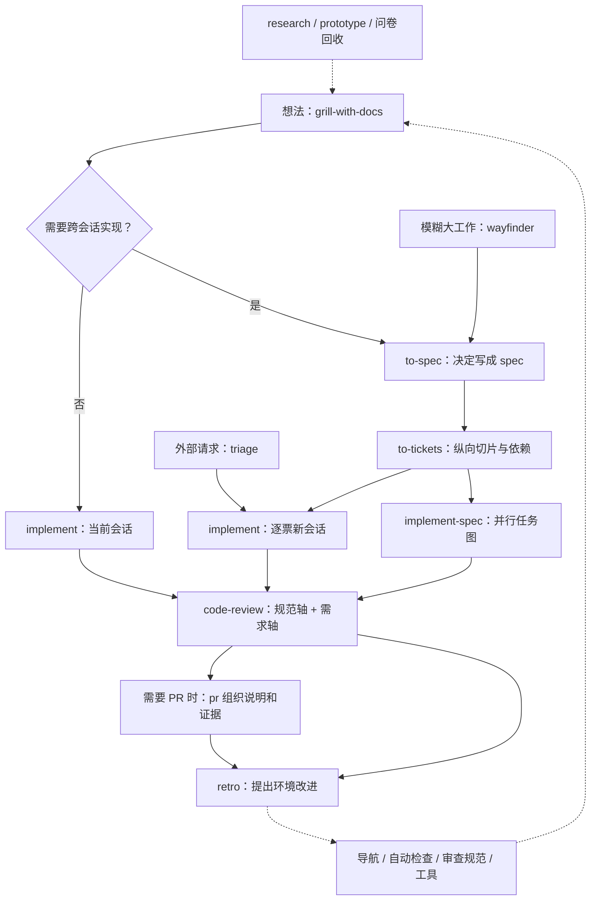
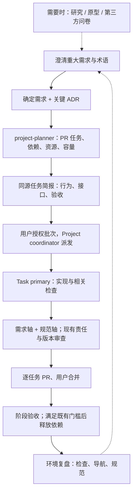

# Matt Pocock Skills：全量用途与工作流研究

调查日期：2026-10-07（北京时间）。固定上游版本：[`f3fc5632f401156837ee3872f14fe33ccf1024ea`](https://github.com/mattpocock/skills/commit/f3fc5632f401156837ee3872f14fe33ccf1024ea)，提交时间为北京时间 18:22:44；`.claude-plugin/plugin.json` 的版本号为 1.3.1。上游 main 之后可能继续变化；本文不把源库提交等同于用户已安装版本或插件市场实际版本。

范围是该提交 `skills/` 下的全部 38 个 `SKILL.md`：Engineering 20 个，Productivity 7 个，Misc 4 个，In-progress 7 个。官方 README 和插件清单覆盖前两类，共 27 个。Misc/In-progress 的用途也纳入研究，但不把它们描述成官方主线中的必经步骤。依据：[README][readme]、[插件清单][plugin]、各 skill 源码。

“Matt 如何使用”的证据是他的官方站点、公开路由 skill 和实际 skill 指令；这是他公开推荐和编码进工具的工作流，不是对其私人会话或每一天操作顺序的观察。来源：[官方 Skills 总览](https://www.aihero.dev/skills)、[Ask Matt][ask-matt]。

## 1. 最近值得注意的变化

- `implement-spec`、`pr`、`retro` 已进入正式 Engineering 集合，分别补上整份 spec 并行实现、PR 说明和环境复盘。
- 领域词汇文档由 `CONTEXT.md` / `CONTEXT-MAP.md` 改为 `GLOSSARY.md` / `GLOSSARY-MAP.md`。
- `resolving-merge-conflicts` 已被删除，未指定替代 skill；历史文档仍可存在，但不计入当前 38 个。
- 更早的命名与整合包括：`to-prd` → `to-spec`；`to-plan` 与 `to-issues` 合并为 `to-tickets`；`writing-great-skills` → `writing-for-agents`；`ubiquitous-language` 并入 `domain-modeling`，`design-an-interface` 并入 `codebase-design`，`qa` 并入 `triage` / `to-tickets`，`request-refactor-plan` 并入 `to-spec` / `improve-codebase-architecture`。

上述变动来自 [CHANGELOG][changelog]，不意味着全部发生在今天。今天最新提交修正了 diagnosing-bugs 对强制失败变更的验证；同日其他提交涉及 code-review 的规范发现与审查助手、setup 的标签创建、implement 的票据读取、grilling 的问题措辞、tdd 的测试 seam 覆盖说明，以及 wayfinder 的标签与研究分支。来源：[固定版本提交][head]、[当天提交历史](https://github.com/mattpocock/skills/commits/main/)。

本机抽样对照：`C:/Users/goey8/.codex/skills/domain-modeling/SKILL.md` 和 `tdd/SKILL.md` 仍使用 `CONTEXT.md`，可见上游规则与本机安装副本已有差别。这里仅对照已读文件，没有推断全部本机 skills 的来源/版本，也没有执行更新。

## 2. Skill 的两层结构

**用户触发 U**：由人选择何时开始某种流程。**模型可触发 M**：人也能显式调用，agent 也能按场景使用。正式 27 个中 U 16 个、M 11 个。用户触发 skill 可以调用模型可触发 skill；任何 skill 都不能自动调用另一个用户触发 skill。箭头串联主流程时，经常表示人选择下一步和传递产物，不代表 skill 之间自动调用。

这是这套体系保留用户控制的主要机制。`ask-matt` 负责建议，用户选择流程；`grilling`、`domain-modeling`、`tdd` 等提供复用方法。它没有把全部过程包成一个自动执行的大命令。来源：[调用模型][invocation]、[Ask Matt][ask-matt]。

## 3. 正式 27 个 skills

### 3.1 初始化、澄清与规划

| Skill | 触发 | 用途与产物 | 放在什么位置 |
| --- | --- | --- | --- |
| [setup-matt-pocock-skills][setup-matt-pocock-skills] | U | 确定 tracker、triage 标签和领域文档布局，写入配置文档及入口指针；需要时创建缺少的标签。 | 工程流程首次使用前，一仓库配置一次。 |
| [ask-matt][ask-matt] | U | 按当前情况推荐 skill 和路线，说明分支与上下文衔接；推荐前读取实际 skill。 | 导航入口，不是自动执行器，也不是任意作者 skills 的通用路由。 |
| [grill-with-docs][grill-with-docs] | U | 联合 grilling 与 domain-modeling，追问设计并随决定落定维护词汇表和 ADR。 | 有工作目录时的常规澄清入口。 |
| [wayfinder][wayfinder] | U | 把单会话装不下的模糊大工作写成决策地图，逐项研究、原型验证或讨论，清除未知。 | 大型探索前置；默认交付决定，不直接实现目标。 |
| [to-spec][to-spec] | U | 将已经讨论好的决定综合成 spec，记录行为、实现取舍、测试决定和非目标，发布 tracker。 | 跨会话实现前；不重新访谈，但仍确认测试 seam。 |
| [to-tickets][to-tickets] | U | 拆成可独立演示/验证、单会话可完成的纵向切片；记录阻塞边，经用户认可后发布。 | spec/谈妥计划之后；本地一票一文件或真实 tracker 一票一 issue。 |

### 3.2 实现、审查与改进

| Skill | 触发 | 用途与产物 | 放在什么位置 |
| --- | --- | --- | --- |
| [implement][implement] | U | 实现一项 spec/票据；在约定 seam 驱动 tdd，运行类型/测试检查、code-review，再提交当前分支。 | 小工作原会话执行，或大工作逐票执行。 |
| [implement-spec][implement-spec] | U | 读取票据 DAG，在无阻塞前沿派发 worktree 实现助手，将结果汇入一个集成分支并整体审查。 | 整份 spec 的并行替代路线；PR 有条件创建。 |
| [tdd][tdd] | M | 在约定公共接口一次写一个失败测试、做最小实现；以独立期望值验证行为，避免内部耦合与同义反复测试。 | 实现内循环，也可单独使用。当前正文将重构放在审查阶段。 |
| [code-review][code-review] | M | 固定比较基点后，以两个并行助手分别审查 Standards 和 Spec；规范轴含仓库规范与启发式代码异味。 | 实现收尾；两轴分开报告，缺失 spec 要明确披露。 |
| [pr][pr] | M | 按最小必要图示、变更前后证据、可逆性与影响范围组织 PR 正文。 | 写 PR 说明时；本身是正文形状，不独立授权发布或合并。 |
| [retro][retro] | U | 从会话一手记录找环境改进：导航、自动检查、规范、指令、工具成本与信息访问。 | 工作结束后，尽量在清空会话前；提出候选，不自动改环境。 |
| [improve-codebase-architecture][improve-codebase-architecture] | U | 从近期频繁变化区域寻找浅模块和认知摩擦，出 HTML 前后对照报告，选择候选后讨论。 | 代码库保养入口，生成新设计工作；不直接批量重构。 |

### 3.3 查明事实、验证问题与共享方法

| Skill | 触发 | 用途与产物 | 放在什么位置 |
| --- | --- | --- | --- |
| [triage][triage] | U | 分诊外部 bug/请求，可配置纳入外部 PR；核实后生成 brief、追问或拒绝记录，赋类别和状态。 | 外来工作入口；不再次分诊 to-tickets 已生成的票。 |
| [diagnosing-bugs][diagnosing-bugs] | M | 先建立能捕获确切症状的反馈命令，再复现最小化、列可证伪假设、探针、修复和回归验证。 | 难 bug/性能回归的专门路线；缺正确 seam 需披露。 |
| [prototype][prototype] | M | 回答一个具体设计问题：逻辑用单文件 HTML，UI 用可切换的多种明显不同方案。 | 澄清中的实证支线；原型作为一手证据保留在独立原型分支。 |
| [research][research] | M | 后台助手读取官方资料/源码，留下带引用的 Markdown。 | 事实不清时提供证据，回流澄清与决策。 |
| [domain-modeling][domain-modeling] | M | 挑战含混术语、用情景检验领域关系，及时更新 GLOSSARY；重大真实取舍酌情记 ADR。 | 跨多个流程的共享领域建模方法；词汇表只存领域术语。 |
| [codebase-design][codebase-design] | M | 以简单接口隐藏复杂行为，讨论 seam、adapter、depth、locality；附多方案独立设计法。 | TDD/架构探索等的设计参考层，不是一个必须走完的阶段。 |
| [wizard][wizard] | M | 为只有人能完成的操作生成交互 bash 向导，逐步打开页面、采集值、写配置/CI secret。 | 配置或迁移出现人工步骤时；生成脚本，交给人运行。 |

### 3.4 通用生产力

| Skill | 触发 | 用途与产物 | 放在什么位置 |
| --- | --- | --- | --- |
| [grill-me][grill-me] | U | 调用 grilling 澄清计划，但不写本地领域文档。 | 无工作目录的一般计划/设计讨论。 |
| [grilling][grilling] | M | 按决策依赖树逐轮询问当前可回答的问题，附推荐答案；agent 查事实，人作决定。 | grill-me/grill-with-docs/triage/wayfinder/架构探索共享访谈方法。 |
| [handoff][handoff] | U | 把当前会话摘要写到 OS 临时目录，保留产物指针、下一会话重点及建议 skills，脱敏。 | 换 agent 环境、目录、同事或分出支线；避免重抄已有资料。 |
| [teach][teach] | U | 以学习目的、资源、学习记录、短 HTML 课程和复用素材形成跨会话教学目录。 | 独立学习流程，按掌握程度、回忆练习与间隔练习推进。 |
| [to-questionnaire][to-questionnaire] | U | 问清问卷发给谁、需要拿回什么，再生成 Markdown 问卷交给掌握知识的人。 | 关键答案在第三方那里时；它生成问卷，不自动发送。 |
| [wait-what][wait-what] | U | 将上一条没讲明白的信息重新说明，补背景并使用词汇表的共享语言。 | 任何对话中即时纠偏。其英文写作要求需要按中文环境适配。 |
| [writing-for-agents][writing-for-agents] | M | 给 agent 文档设计触发指针、步骤/参考分层、可检查完成条件；减少重复和无效指令。 | 写 skill、AGENTS/CLAUDE 及其引用文档时，也是 retro 的参考。 |

## 4. 作者公开的主工作流

以下图表示流程选择和产物传递；不表示用户触发 skills 自动互调。依据：[Ask Matt][ask-matt] 与 [官方流程分组](https://www.aihero.dev/skills)。

code-review 在 implement/implement-spec 内部触发，是图中单独展开的收尾，不要求用户重复调用。implement 单票驱动 tdd；implement-spec 的每个实现助手驱动 tdd，最终统一审查集成分支。setup 是仓库前置，ask-matt 是导航，不是每票都执行的步骤。来源：[implement][implement]、[implement-spec][implement-spec]。

### 4.1 工作规模决定路线

- **小而清楚**：grill-with-docs → implement。没有跨会话需要时，不强制 spec 和拆票。
- **讨论清楚、实现量大**：grill-with-docs → to-spec → to-tickets → 逐票 implement 或整份 implement-spec。
- **连设计空间都装不进一次会话**：wayfinder 先建立 map；研究/原型/访谈等 decision tickets 逐项产出决定，路线清晰后收拢为 spec，再拆 execution tickets。
- **外部请求**：triage 核实与补齐 brief，再由 implement 接手。**困难 bug** 则可直接进入 diagnosing-bugs；修完后由用户运行 retro，需要改善测试 seam 时再做架构探索。
- **架构健康**：improve-codebase-architecture 发现候选；用户选择候选后设计讨论，产生的新工作回到主线。

这些路线在 [Ask Matt][ask-matt] 中有明文支持，不是本报告凭名称猜测。Wayfinder 的 task 类型可以做解锁决定所需的前置操作，但默认不交付整个目标；Notes 可显式改变该默认。它的决策票使用 `wayfinder:*` 标签，不应贴实现 readiness 标签。来源：[Wayfinder][wayfinder]。

### 4.2 几个容易误读的边界

1. **spec、decision ticket、execution ticket 不是同一件事。** 分别记录既定行为/决定、尚待回答的问题、要交付的实现切片。
2. **ready-for-agent 不等于可以立刻开始。** 票据内容已齐仍可能有阻塞边；并行执行取无未完成阻塞的 frontier。to-spec 也给父 spec 加 readiness 标签，自动领取器应区分记录类型，避免父项被当成执行票。[to-spec 解释](https://www.aihero.dev/skills-to-spec)、[to-tickets][to-tickets]。
3. **纵向切片是默认，不是绝对。** 大范围机械迁移允许 expand → 分批 migrate → contract，必要时共享集成分支，在最终集成点承诺全绿。[to-tickets][to-tickets]。
4. **throwaway 原型不等于一定删除证据。** 当前 prototype 要求保留可运行一手来源，生产主线只保留验证出的决定。[prototype][prototype]。
5. **当前 tdd 正文不是通常表述的完整 red-green-refactor 内循环。** 正文明确采用 red → green，把重构放在审查阶段；README/站点仍可见 red-green-refactor 的概括。描述具体行为时以实际 SKILL.md 为准。[tdd][tdd]、[README][readme]。
6. **公开文本也有衔接缺口。** implement 要求先 review 后 commit，但 code-review 给出的固定 diff 是 merge-base 到 HEAD；若新增代码仍未提交，该命令不能覆盖它。这是静态阅读可见的契约缺口，本次没有跑实现复现。自己的流程应明确审查 commit/工作区快照，确保审查涵盖实际交付版本。[implement][implement]、[code-review][code-review]。

## 5. 如何管理上下文

作者希望澄清 → spec → tickets 尽量在同一会话中完成，以保留为什么这么设计；跨会话 ticket 足够独立后，再清空旧上下文逐票实现。retro 在清空前运行，清空后则需读会话日志。原型需要换目录时用 handoff 双向传递问题与发现。来源：[Ask Matt][ask-matt]。

在阶段边界，按顺序考虑：继续当前会话；旧上下文完全无关时 clear；需要跨环境/目录/人传递时 handoff；可独立无人值守的有界工作用 subagent；其余保留相关信息而空间不足时 compact。原文的固定 token 经验数不宜当所有模型的通用阈值。这里借鉴选择条件，不照搬数值。来源：[PHASE-BOUNDARIES][phase-boundaries]。

## 6. 与本项目现有流程结合的建议

以下是本次研究后的建议，不是 Matt 对本项目的具体建议，也没有实施修改。对照本项目 `project-planner/SKILL.md`、`references/schema.md`、身份/子代理/独立开发任务规范与此前研究笔记。

### 值得优先吸收

1. **在需求与排程之间设清晰的澄清接口。** 未决产品决定先解决，必要时用 research/prototype/问卷收集证据；普通实现细节继续按 planner 的既有规则用保守假设。产出词汇表、少量 ADR 和确定的需求，再交给 planner。
2. **给每项 PR 任务补一份可独立消费的实现简报。** 当前行为、目标行为、关键接口、非目标、验收证据、必要指针；来源与稳定 task ID 一致，尽量从同一规划输入生成，避免手写多份漂移。每张功能票回答“做完能演示哪条完整行为”；前置契约与机械迁移则记录其独立验收理由。
3. **将三种状态继续分开。** readiness 表示需求资料完整；执行状态表示谁在做/达到什么 gate；dependency 表示哪些上游交付挡住它。本项目已区分状态、资源与依赖，不应被一个 ready 标签替代。
4. **保留两个审查轴。** 本项目 Primary/Task primary 的责任链和版本证据仍是最终门槛；可将需求匹配与工程规范分开调查/报告，避免一轴掩盖另一轴。执行层的审查应覆盖实际交付 snapshot。
5. **增设一次轻量环境复盘。** 机械错误进入现有 lint/类型检查/CI，判断性问题才进入审查规范；只补有实际触发条件的导航指针。每轮选择少量有证据的改进，维持规范所有权与用户授权边界。

`loop-me` 还有一组很适合工作流设计的概念：Trigger 规定什么事件启动一轮，Checkpoint 规定哪里需要人判断，Brief 规定交给人的决策简报，而 Push right 要求把可独立完成的准备工作尽量前置，让人看到可审阅结果再决定。可借鉴这组契约来减少重复确认；产品决定若影响后续实现，仍应先澄清。该 skill 当前在 In-progress，建议先吸收概念，不把其全部要求直接升级为本项目规范。[loop-me][loop-me]。

### 保留本项目自己的交付边界

Matt 的 implement-spec 是内部助手 + 各自 worktree + 单集成分支，和本项目“独立 Task primary + 每任务 PR + 用户合并 + 阶段验收”不是同一种工作流。本项目 planner 的交付依赖只有在前置验收、PR 合并及需要的阶段 gate 后释放；不能改成“某个内部助手做完就开下游”。并行仍要同时检查交付依赖、资源锁、共享写边界和实际容量。依据：[本项目 planner](../../project-planner/SKILL.md)、[本项目独立任务规范](../../.codex/policies/DEVELOPMENT_TASK_WORKFLOW_AGENT.md)、[上游 implement-spec][implement-spec]。

同理，上游 Wayfinder/research 的某些组合包含多层 subagent 委派；本项目明确禁止子代理再委派。借鉴时由 Primary 直接创建平级有界助手，不复制递归委派。来源：[上游 Wayfinder][wayfinder]、[上游 research][research]、[本项目子代理规范](../../.codex/policies/SUBAGENT_POLICY_AGENT.md)。

不把“每个问题都穷尽”“每个 seam 每次重确认”“长用户故事清单”变成无条件仪式。仅在高影响未决处阻断，已有确认保留其效力；完成标准靠可观察覆盖和证据衡量。Matt 的策略是减少误解的一种选择，本项目更强调务实问答和保留已有授权。外部发布、自动提交/合并等仍服从本项目和用户授权。

建议的结合路线：

## 7. 其余 11 个 skills

下面按源码概括，详细输入、产物、限制和调用证据见同日附录 [其余 skills 逐项研究](matt-pocock-extra-skills-2026-10-07.md)。In-progress 目录明文为 Beta，不进正式插件，可能变更或消失；Misc 则是作者很少使用、未提升到插件的工具。[In-progress 说明][in-progress-readme]、[Misc 说明][misc-readme]。

| Skill | 分类 | 用途 |
| --- | --- | --- |
| [chief-of-staff][chief-of-staff] | In-progress | 长期目标协调角色，通过助手做工作，同时改善下一轮 agent 环境；未定义与其他流程的具体链路。 |
| [loop-me][loop-me] | In-progress | 访谈重复活动，产出可实施的 `workflows/*.md`，设计触发、checkpoint 与决策简报；本身不执行自动化。 |
| [claude-handoff][claude-handoff] | In-progress | 写交接摘要并用 Claude CLI 启动新的后台 agent；比 handoff 多了启动动作，依赖特定运行环境。 |
| [setup-ts-deep-modules][setup-ts-deep-modules] | In-progress | 配 dependency-cruiser，让包入口为公共面、子目录为私有实现，并证明违规检查会失败。 |
| [writing-fragments][writing-fragments] | In-progress | 通过讨论采集写作片段，追加到 Markdown 原料文件，暂不确定结构。 |
| [writing-shape][writing-shape] | In-progress | 从原料选论点和不同开头，再逐段塑造一篇单独文章。 |
| [writing-beats][writing-beats] | In-progress | 从原料每轮提供多个下一叙事节点，由用户选择后逐拍成文；先建立概念再使用。 |
| [git-guardrails-claude-code][git-guardrails-claude-code] | Misc | 配 Claude Code Bash hook 拦截某些 Git 命令模式；不是跨 agent/shell 的普遍保障。 |
| [migrate-to-shoehorn][migrate-to-shoehorn] | Misc | 迁移 TS 测试中的 `as` 数据断言为 shoehorn 的部分/故意错误数据构造。 |
| [scaffold-exercises][scaffold-exercises] | Misc | 按 AI Hero 课程仓库约定建课程练习目录、problem/solution/explainer 和基础文件。 |
| [setup-pre-commit][setup-pre-commit] | Misc | 配 Husky、lint-staged、Prettier 与项目已有类型/测试检查，形成提交前反馈。 |

写作组可按“fragments → shape 或 beats”组合，这是输入/产物接口的推断，源码没有明确要求这条调用链。chief-of-staff 没有明确接到 loop-me。因而不把所有 38 个强拼成一个统一流程；正式工程主线之外还有独立教学、写作和长期活动设计用途。

## 8. 调研执行与验证记录

当前身份为普通 Primary，未启用独立开发任务工作流。调查在当前 `dev` 工作目录进行，项目基线为 `abb6acd7a086047194174acdbdca33f3286a5460`；既有 `docs/` 是未追踪用户工作，保留原文件。未修改需求、业务代码、skills 安装或规范，未创建 commit/PR/Issue。

委派评估：正式 27 项与主工作流由 Primary 阅读，另 11 项属于独立有界用途调查，可与流程还原并行，有明确文件与验收边界，因此依 research skill 委派一名内部 Subagent（Luna max）负责附录。助手禁止再委派；仅写附录，Primary 只写本报告，并在收到后核对实际内容与证据。

来源库独立保存在会话可写目录，`git rev-parse HEAD` 与固定 SHA 一致。全量树查询与本地目录均计得 38 个 SKILL.md；正式插件清单 27 个。Primary 已逐项对照附录与 11 个目标 SKILL.md 及目录说明，接受此调研单元。阅读均作为调研数据，没有执行上游 skill 指令。本文不包含栅格图片，图以 Mermaid 文本保存。

[readme]: https://github.com/mattpocock/skills/blob/f3fc5632f401156837ee3872f14fe33ccf1024ea/README.md
[plugin]: https://github.com/mattpocock/skills/blob/f3fc5632f401156837ee3872f14fe33ccf1024ea/.claude-plugin/plugin.json
[changelog]: https://github.com/mattpocock/skills/blob/f3fc5632f401156837ee3872f14fe33ccf1024ea/CHANGELOG.md
[head]: https://github.com/mattpocock/skills/commit/f3fc5632f401156837ee3872f14fe33ccf1024ea
[invocation]: https://github.com/mattpocock/skills/blob/f3fc5632f401156837ee3872f14fe33ccf1024ea/.agents/invocation.md
[phase-boundaries]: https://github.com/mattpocock/skills/blob/f3fc5632f401156837ee3872f14fe33ccf1024ea/skills/engineering/ask-matt/PHASE-BOUNDARIES.md
[in-progress-readme]: https://github.com/mattpocock/skills/blob/f3fc5632f401156837ee3872f14fe33ccf1024ea/skills/in-progress/README.md
[misc-readme]: https://github.com/mattpocock/skills/blob/f3fc5632f401156837ee3872f14fe33ccf1024ea/skills/misc/README.md
[ask-matt]: https://github.com/mattpocock/skills/blob/f3fc5632f401156837ee3872f14fe33ccf1024ea/skills/engineering/ask-matt/SKILL.md
[code-review]: https://github.com/mattpocock/skills/blob/f3fc5632f401156837ee3872f14fe33ccf1024ea/skills/engineering/code-review/SKILL.md
[codebase-design]: https://github.com/mattpocock/skills/blob/f3fc5632f401156837ee3872f14fe33ccf1024ea/skills/engineering/codebase-design/SKILL.md
[diagnosing-bugs]: https://github.com/mattpocock/skills/blob/f3fc5632f401156837ee3872f14fe33ccf1024ea/skills/engineering/diagnosing-bugs/SKILL.md
[domain-modeling]: https://github.com/mattpocock/skills/blob/f3fc5632f401156837ee3872f14fe33ccf1024ea/skills/engineering/domain-modeling/SKILL.md
[grill-with-docs]: https://github.com/mattpocock/skills/blob/f3fc5632f401156837ee3872f14fe33ccf1024ea/skills/engineering/grill-with-docs/SKILL.md
[implement-spec]: https://github.com/mattpocock/skills/blob/f3fc5632f401156837ee3872f14fe33ccf1024ea/skills/engineering/implement-spec/SKILL.md
[implement]: https://github.com/mattpocock/skills/blob/f3fc5632f401156837ee3872f14fe33ccf1024ea/skills/engineering/implement/SKILL.md
[improve-codebase-architecture]: https://github.com/mattpocock/skills/blob/f3fc5632f401156837ee3872f14fe33ccf1024ea/skills/engineering/improve-codebase-architecture/SKILL.md
[pr]: https://github.com/mattpocock/skills/blob/f3fc5632f401156837ee3872f14fe33ccf1024ea/skills/engineering/pr/SKILL.md
[prototype]: https://github.com/mattpocock/skills/blob/f3fc5632f401156837ee3872f14fe33ccf1024ea/skills/engineering/prototype/SKILL.md
[research]: https://github.com/mattpocock/skills/blob/f3fc5632f401156837ee3872f14fe33ccf1024ea/skills/engineering/research/SKILL.md
[retro]: https://github.com/mattpocock/skills/blob/f3fc5632f401156837ee3872f14fe33ccf1024ea/skills/engineering/retro/SKILL.md
[setup-matt-pocock-skills]: https://github.com/mattpocock/skills/blob/f3fc5632f401156837ee3872f14fe33ccf1024ea/skills/engineering/setup-matt-pocock-skills/SKILL.md
[tdd]: https://github.com/mattpocock/skills/blob/f3fc5632f401156837ee3872f14fe33ccf1024ea/skills/engineering/tdd/SKILL.md
[to-spec]: https://github.com/mattpocock/skills/blob/f3fc5632f401156837ee3872f14fe33ccf1024ea/skills/engineering/to-spec/SKILL.md
[to-tickets]: https://github.com/mattpocock/skills/blob/f3fc5632f401156837ee3872f14fe33ccf1024ea/skills/engineering/to-tickets/SKILL.md
[triage]: https://github.com/mattpocock/skills/blob/f3fc5632f401156837ee3872f14fe33ccf1024ea/skills/engineering/triage/SKILL.md
[wayfinder]: https://github.com/mattpocock/skills/blob/f3fc5632f401156837ee3872f14fe33ccf1024ea/skills/engineering/wayfinder/SKILL.md
[wizard]: https://github.com/mattpocock/skills/blob/f3fc5632f401156837ee3872f14fe33ccf1024ea/skills/engineering/wizard/SKILL.md
[chief-of-staff]: https://github.com/mattpocock/skills/blob/f3fc5632f401156837ee3872f14fe33ccf1024ea/skills/in-progress/chief-of-staff/SKILL.md
[claude-handoff]: https://github.com/mattpocock/skills/blob/f3fc5632f401156837ee3872f14fe33ccf1024ea/skills/in-progress/claude-handoff/SKILL.md
[loop-me]: https://github.com/mattpocock/skills/blob/f3fc5632f401156837ee3872f14fe33ccf1024ea/skills/in-progress/loop-me/SKILL.md
[setup-ts-deep-modules]: https://github.com/mattpocock/skills/blob/f3fc5632f401156837ee3872f14fe33ccf1024ea/skills/in-progress/setup-ts-deep-modules/SKILL.md
[writing-beats]: https://github.com/mattpocock/skills/blob/f3fc5632f401156837ee3872f14fe33ccf1024ea/skills/in-progress/writing-beats/SKILL.md
[writing-fragments]: https://github.com/mattpocock/skills/blob/f3fc5632f401156837ee3872f14fe33ccf1024ea/skills/in-progress/writing-fragments/SKILL.md
[writing-shape]: https://github.com/mattpocock/skills/blob/f3fc5632f401156837ee3872f14fe33ccf1024ea/skills/in-progress/writing-shape/SKILL.md
[git-guardrails-claude-code]: https://github.com/mattpocock/skills/blob/f3fc5632f401156837ee3872f14fe33ccf1024ea/skills/misc/git-guardrails-claude-code/SKILL.md
[migrate-to-shoehorn]: https://github.com/mattpocock/skills/blob/f3fc5632f401156837ee3872f14fe33ccf1024ea/skills/misc/migrate-to-shoehorn/SKILL.md
[scaffold-exercises]: https://github.com/mattpocock/skills/blob/f3fc5632f401156837ee3872f14fe33ccf1024ea/skills/misc/scaffold-exercises/SKILL.md
[setup-pre-commit]: https://github.com/mattpocock/skills/blob/f3fc5632f401156837ee3872f14fe33ccf1024ea/skills/misc/setup-pre-commit/SKILL.md
[grill-me]: https://github.com/mattpocock/skills/blob/f3fc5632f401156837ee3872f14fe33ccf1024ea/skills/productivity/grill-me/SKILL.md
[grilling]: https://github.com/mattpocock/skills/blob/f3fc5632f401156837ee3872f14fe33ccf1024ea/skills/productivity/grilling/SKILL.md
[handoff]: https://github.com/mattpocock/skills/blob/f3fc5632f401156837ee3872f14fe33ccf1024ea/skills/productivity/handoff/SKILL.md
[teach]: https://github.com/mattpocock/skills/blob/f3fc5632f401156837ee3872f14fe33ccf1024ea/skills/productivity/teach/SKILL.md
[to-questionnaire]: https://github.com/mattpocock/skills/blob/f3fc5632f401156837ee3872f14fe33ccf1024ea/skills/productivity/to-questionnaire/SKILL.md
[wait-what]: https://github.com/mattpocock/skills/blob/f3fc5632f401156837ee3872f14fe33ccf1024ea/skills/productivity/wait-what/SKILL.md
[writing-for-agents]: https://github.com/mattpocock/skills/blob/f3fc5632f401156837ee3872f14fe33ccf1024ea/skills/productivity/writing-for-agents/SKILL.md
